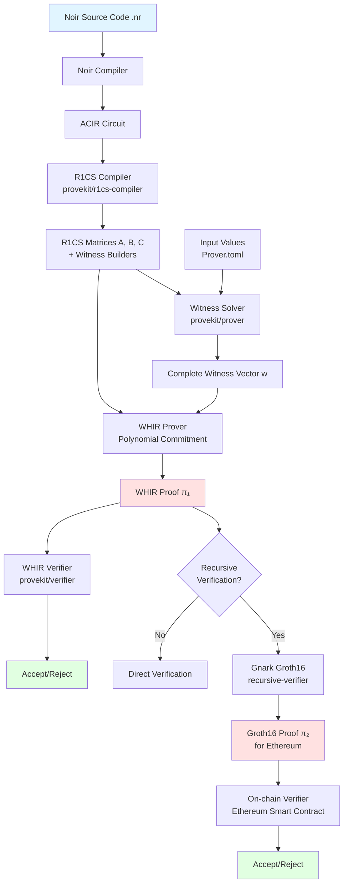
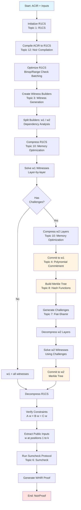
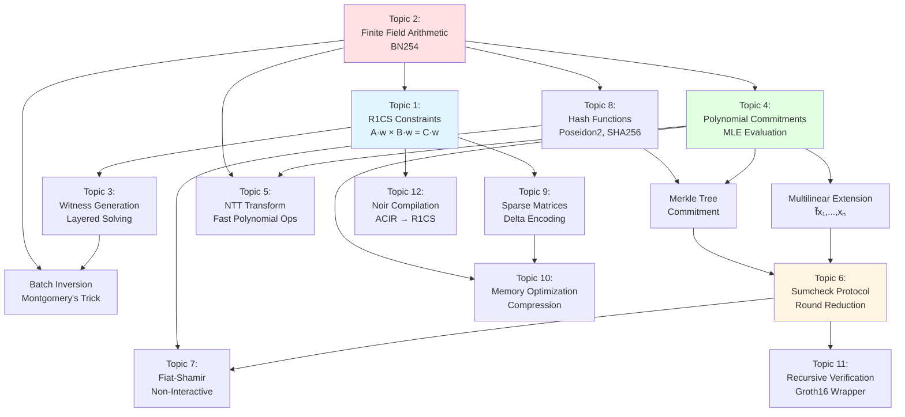
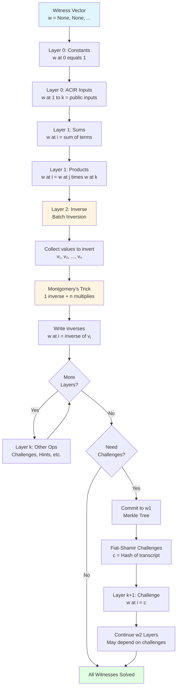
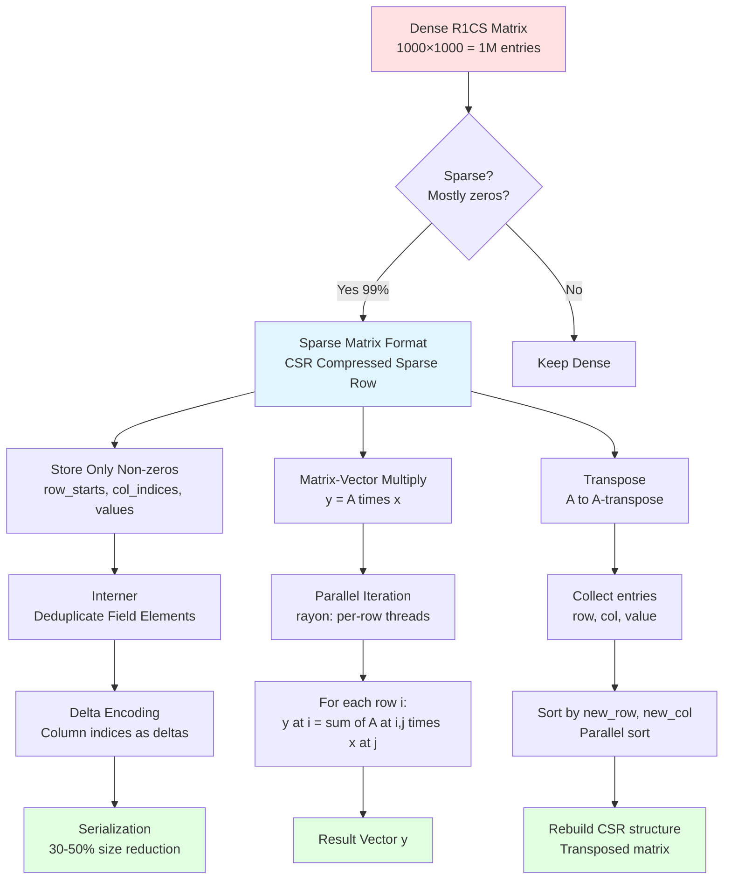
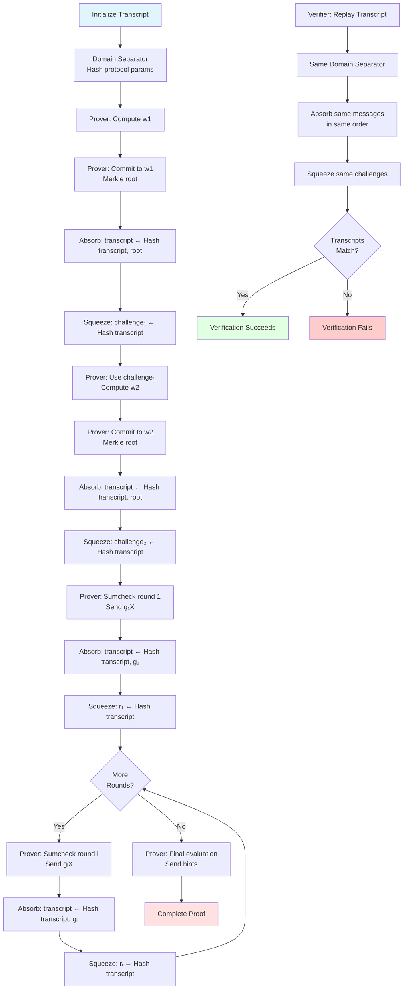
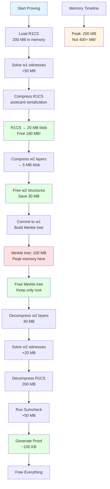
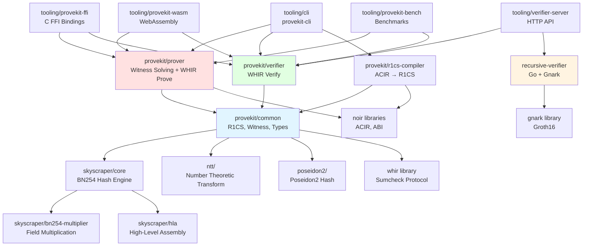

# ProveKit Documentation

## What does this project do?

ProveKit is a zero-knowledge proof toolkit optimized for mobile devices by the World Foundation.

ProveKit compiles Noir circuits (a domain-specific language for zero-knowledge proofs) into R1CS (Rank-1 Constraint System) constraints and generates/verifies WHIR proofs. The workflow is:

1. Takes Noir circuits (written in the Noir language) as input
2. Compiles them to R1CS constraint matrices using an optimized compiler
3. Generates zero-knowledge proofs using the WHIR proof system with witness solving and commitment
4. Verifies those proofs efficiently
5. Can recursively verify proofs in Gnark for on-chain verification

The project is built in Rust (~95%) with a Go recursive verifier component. It's designed to be modular with clear separation between compilation, proving, and verification stages.

### Key Features

- Mobile-optimized performance with custom SIMD-accelerated field arithmetic
- Multiple hash function support (Skyscraper, SHA256, Keccak, Blake3)
- Memory compression techniques for resource-constrained devices
- FFI bindings for iOS, Android, Python, Swift, and Kotlin
- Benchmarking and profiling tools included

The codebase includes extensive Noir example circuits for testing and benchmarking, from basic programs to complex passport verification systems.

## System Architecture Flowcharts

### High-Level Proof Generation Flow



### Detailed Proving Process



### Mathematical Concepts Dependency Graph



### Witness Solving Flow



### Sparse Matrix Operations



### Fiat-Shamir Transcript Flow



### Memory Optimization Strategy



### Codebase Module Dependencies



## Core Mathematical Topics

Based on the codebase analysis, here are the fundamental mathematical concepts and topics involved in ProveKit:

### 1. R1CS (Rank-1 Constraint System)

**What it is:** R1CS is a way to represent any computation as a system of quadratic equations. Think of it like converting a program into a mathematical puzzle where solving the puzzle proves you ran the program correctly.

**The Math:**

An R1CS instance consists of three matrices A, B, C (each of size m × n) and a witness vector w (size n):

```
For each constraint i (where i = 0, 1, ..., m-1):
(A[i] · w) × (B[i] · w) = C[i] · w    (mod p)
```

Where:
- `A[i] · w` means: sum of (A[i,j] × w[j]) for all j from 0 to n-1
- `p` is the BN254 prime: 21888242871839275222246405745257275088548364400416034343698204186575808495617
- `w[0] = 1` (constant one)
- `w[1] to w[num_public_inputs]` = public inputs (visible to everyone)
- `w[num_public_inputs+1] to w[n-1]` = private witnesses (secret values)

**Example:** To prove you know x such that x² = 9:
```
Witness: w = [1, 9, 3]  (w[0]=1, w[1]=public output 9, w[2]=secret input 3)
Constraint: (0·w[0] + 0·w[1] + 1·w[2]) × (0·w[0] + 0·w[1] + 1·w[2]) = (0·w[0] + 1·w[1] + 0·w[2])
Simplifies to: w[2] × w[2] = w[1]
Check: 3 × 3 = 9 ✓
```

**Special case - Linear constraints:**
When A[i] or B[i] is constant (only references w[0]), the constraint becomes linear:
```
If B[i] = [5, 0, 0, ...], then:
(A[i] · w) × 5 = C[i] · w
Which is just: 5·(A[i] · w) - (C[i] · w) = 0
```

**Code reference:**
```rust
// From provekit/common/src/r1cs.rs
pub struct R1CS {
    pub num_public_inputs: usize,
    pub a: SparseMatrix,  // Left matrix
    pub b: SparseMatrix,  // Middle matrix  
    pub c: SparseMatrix,  // Right matrix
}

// Adding a constraint (line ~70):
pub fn add_constraint(
    &mut self,
    a: &[(FieldElement, usize)],  // (coefficient, witness_index) pairs
    b: &[(FieldElement, usize)],
    c: &[(FieldElement, usize)],
)
```

**Key files:**
- `provekit/common/src/r1cs.rs` - R1CS structure and operations
- `provekit/common/src/sparse_matrix.rs` - Efficient sparse matrix representation with delta encoding

### 2. Finite Field Arithmetic (BN254)

**What it is:** All numbers in ProveKit live in a finite field - like a clock that wraps around at a huge prime number. Instead of regular arithmetic, we do "modular arithmetic" where everything is computed modulo p.

**The Math:**

The BN254 scalar field 𝔽_p where:
```
p = 21888242871839275222246405745257275088548364400416034343698204186575808495617
  ≈ 2^254 (hence "BN254")
```

**Field operations:**
```
Addition:       (a + b) mod p
Subtraction:    (a - b) mod p  
Multiplication: (a × b) mod p
Division:       a / b = a × b^(-1) mod p
Inverse:        b^(-1) such that b × b^(-1) ≡ 1 (mod p)
```

**Why modular arithmetic?**
- Finite: numbers don't grow infinitely
- Efficient: computers can handle fixed-size numbers
- Cryptographic: hard to reverse operations without knowing secrets

**Montgomery Representation:**
To make multiplication faster, numbers are stored in "Montgomery form":
```
Instead of storing x, store: x̃ = x × R mod p
where R = 2^256

Multiplication becomes:
x̃ × ỹ = (x × R) × (y × R) mod p = (x × y) × R² mod p
Then reduce: (x × y) × R² × R^(-1) mod p = (x × y) × R mod p = (x̃y)
```

This trades expensive divisions for cheap bit shifts!

**Batch Inversion (Montgomery's Trick):**
Computing many inverses efficiently:
```
To compute a₁⁻¹, a₂⁻¹, ..., aₙ⁻¹:

1. Compute products: p₁ = a₁, p₂ = a₁×a₂, ..., pₙ = a₁×a₂×...×aₙ
2. Compute ONE inverse: pₙ⁻¹ = (a₁×a₂×...×aₙ)⁻¹
3. Work backwards:
   aₙ⁻¹ = pₙ⁻¹ × pₙ₋₁
   aₙ₋₁⁻¹ = (pₙ⁻¹ × pₙ₋₁) × aₙ
   ...

Cost: n multiplications + 1 inversion (instead of n inversions!)
```

**Code reference:**
```rust
// From provekit/common/src/lib.rs
pub type FieldElement = ark_bn254::Fr;  // BN254 scalar field

// Montgomery representation is handled by arkworks internally
// Addition (line in ark_ff crate):
impl Add for Fr {
    fn add(self, other: Fr) -> Fr {
        // Adds in Montgomery form, reduces mod p
    }
}

// Batch inversion used in witness solving
// From provekit/prover/src/r1cs.rs (solve_witness_vec function)
// Inverse layer uses Montgomery's trick for efficiency
```

**Example:**
```
Let p = 7 (tiny example, real p is huge)
Field elements: {0, 1, 2, 3, 4, 5, 6}

5 + 4 = 9 mod 7 = 2
5 × 4 = 20 mod 7 = 6
5 / 4 = 5 × 4⁻¹ mod 7
  where 4⁻¹ = 2 (because 4 × 2 = 8 ≡ 1 mod 7)
  so 5 / 4 = 5 × 2 = 10 mod 7 = 3
```

**Key modules:**
- `skyscraper/core/` - Custom BN254 hash engine with optimized field arithmetic
- `skyscraper/bn254-multiplier/` - Specialized BN254 multiplication
- `provekit/common/src/u256_arith.rs` - 256-bit arithmetic utilities

### 3. Witness Generation and Solving

**What it is:** Given the R1CS constraints and some inputs, we need to compute ALL the witness values (including intermediate calculations) that satisfy every constraint. This is like filling in a Sudoku puzzle where you know some numbers and need to figure out the rest.

**The Math:**

Given:
- R1CS matrices A, B, C
- Public inputs: w[1], w[2], ..., w[num_public_inputs]
- ACIR witness values (from the Noir program execution)

Compute: All remaining witness values w[i] such that every constraint is satisfied.

**Witness Builder Types:**

1. **Constant:** `w[i] = c` (some constant value)

2. **Sum:** `w[i] = Σ(cⱼ × w[jⱼ])` (linear combination)
   ```
   Example: w[5] = 3×w[1] + 7×w[2] + w[4]
   ```

3. **Product:** `w[i] = w[j] × w[k]`
   ```
   Example: w[6] = w[2] × w[3]
   ```

4. **Inverse:** `w[i] = w[j]⁻¹` (multiplicative inverse)
   ```
   Example: w[7] = w[3]⁻¹
   Means: w[7] × w[3] = 1
   ```

5. **Challenge:** `w[i] = Hash(transcript)` (Fiat-Shamir challenge)
   ```
   Used to generate random values from the proof transcript
   ```

**Layered Solving:**

Witnesses must be computed in dependency order. We organize them into layers:

```
Layer 0: Constants and ACIR inputs (no dependencies)
  w[0] = 1
  w[1] = public_input_1
  w[2] = public_input_2
  
Layer 1: Values that depend only on Layer 0
  w[3] = w[1] + w[2]
  w[4] = w[1] × w[2]
  
Layer 2 (Inverse): Batch-inverted values
  w[5] = w[3]⁻¹
  w[6] = w[4]⁻¹
  (Computed together using Montgomery's trick!)
  
Layer 3: Values depending on earlier layers
  w[7] = w[5] × w[6]
  
... and so on
```

**Multi-Round Protocols (w1 → challenges → w2):**

For some circuits, we need to:
1. Solve first batch of witnesses (w1)
2. Commit to w1 (create Merkle tree)
3. Generate challenges from commitment
4. Solve remaining witnesses (w2) using the challenges

```
w1 witnesses: [w[0], w[1], ..., w[k-1]]
  ↓
Commit(w1) → Merkle root
  ↓
Challenge: c = Hash(Merkle_root, transcript)
  ↓
w2 witnesses: [w[k], w[k+1], ..., w[n-1]]
  (may depend on challenge c)
```

**Code reference:**
```rust
// From provekit/common/src/witness/witness_builder.rs
pub enum WitnessBuilder {
    Constant(ConstantTerm),           // w[i] = c
    Sum(usize, Vec<SumTerm>),         // w[i] = Σ(cⱼ × w[jⱼ])
    Product(usize, usize, usize),     // w[i] = w[j] × w[k]
    Inverse(usize, usize),            // w[i] = w[j]⁻¹
    Challenge(usize),                 // w[i] = Hash(transcript)
    // ... 15+ more variants
}

// From provekit/prover/src/r1cs.rs
pub fn solve_witness_vec(
    witness: &mut [Option<FieldElement>],
    layers: LayeredWitnessBuilders,
    acir_witness_map: &WitnessMap<NoirElement>,
    merlin: &mut ProverState<TranscriptSponge>,
) {
    for layer in layers.layers {
        match layer.layer_type {
            LayerType::Inverse => {
                // Use Montgomery's batch inversion trick
                let values: Vec<_> = /* collect values to invert */;
                let inverses = batch_invert(&values);
                // Write back inverses
            }
            LayerType::Other => {
                // Solve each builder individually
                for builder in layer.witness_builders {
                    solve_single_witness(witness, builder, ...);
                }
            }
        }
    }
}
```

**Example:**
```
Circuit: Prove you know x, y such that (x + y)² = 25

Witnesses:
w[0] = 1           (constant)
w[1] = 25          (public output)
w[2] = 3           (secret input x)
w[3] = 2           (secret input y)
w[4] = w[2] + w[3] = 5    (sum)
w[5] = w[4] × w[4] = 25   (square)

Constraints:
1. w[4] = w[2] + w[3]  (sum constraint)
2. w[5] = w[4] × w[4]  (square constraint)
3. w[5] = w[1]         (output constraint)
```

**Key files:**
- `provekit/common/src/witness/witness_builder.rs` - Witness builder types
- `provekit/common/src/witness/scheduling/` - Layer scheduling and dependency resolution
- `provekit/prover/` - Witness solving implementation

### 4. Polynomial Commitments and Evaluation

**What it is:** A polynomial commitment is like putting a polynomial in a locked box. You can prove properties about the polynomial (like its value at a specific point) without revealing the polynomial itself.

**The Math:**

**Multilinear Extension (MLE):**
Given a vector v = [v₀, v₁, v₂, ..., v_{2ⁿ-1}], we extend it to a polynomial f̃(x₁, x₂, ..., xₙ) such that:
```
f̃(b₁, b₂, ..., bₙ) = v[b₁×2^(n-1) + b₂×2^(n-2) + ... + bₙ×2⁰]
for all binary values bᵢ ∈ {0, 1}
```

The MLE formula:
```
f̃(x₁, x₂, ..., xₙ) = Σ v[i] × L_i(x₁, x₂, ..., xₙ)
                      i=0 to 2ⁿ-1

where L_i is the Lagrange basis polynomial:
L_i(x₁, ..., xₙ) = ∏ (xⱼ if bit j of i is 1, else (1-xⱼ))
                   j=1 to n
```

**Example:**
```
Vector: v = [3, 7, 2, 5]  (length 4 = 2²)
MLE: f̃(x₁, x₂)

At binary points:
f̃(0,0) = v[0] = 3
f̃(0,1) = v[1] = 7
f̃(1,0) = v[2] = 2
f̃(1,1) = v[3] = 5

At arbitrary point (0.5, 0.3):
f̃(0.5, 0.3) = 3×(1-0.5)×(1-0.3) + 7×(1-0.5)×0.3 
             + 2×0.5×(1-0.3) + 5×0.5×0.3
            = 3×0.5×0.7 + 7×0.5×0.3 + 2×0.5×0.7 + 5×0.5×0.3
            = 1.05 + 1.05 + 0.7 + 0.75 = 3.55
```

**Merkle Tree Commitment:**
To commit to a polynomial (represented as a vector):
```
1. Hash pairs of values bottom-up:
   
   Level 0: [v₀, v₁, v₂, v₃, v₄, v₅, v₆, v₇]
            ↓   ↓   ↓   ↓   ↓   ↓   ↓   ↓
   Level 1: [H(v₀,v₁), H(v₂,v₃), H(v₄,v₅), H(v₆,v₇)]
            ↓         ↓         ↓         ↓
   Level 2: [H(H(v₀,v₁),H(v₂,v₃)), H(H(v₄,v₅),H(v₆,v₇))]
            ↓                     ↓
   Root:    H(...)

2. Commitment = Merkle root (single hash value)

3. To prove v₃ is in the tree, provide:
   - v₃
   - v₂ (sibling)
   - H(v₀,v₁) (uncle)
   - H(H(v₄,v₅),H(v₆,v₇)) (uncle)
   
   Verifier recomputes root and checks it matches
```

**Linear Forms and Covectors:**
A covector α is a row vector that defines a linear function:
```
α · v = α₀×v₀ + α₁×v₁ + ... + αₙ₋₁×vₙ₋₁

For MLE evaluation at point r = (r₁, r₂, ..., rₙ):
The covector is the Lagrange basis: α = [L₀(r), L₁(r), ..., L_{2ⁿ-1}(r)]
Then: f̃(r) = α · v
```

**Memory Optimization - PrefixCovector:**
When α has many trailing zeros: α = [α₀, α₁, ..., α_k, 0, 0, ..., 0]
Store only the prefix [α₀, α₁, ..., α_k] and remember the full size.

**Code reference:**
```rust
// From provekit/common/src/prefix_covector.rs

// Multilinear extension evaluation
impl LinearForm<FieldElement> for PrefixCovector {
    fn mle_evaluate(&self, point: &[FieldElement]) -> FieldElement {
        let k = self.vector.len().trailing_zeros() as usize;
        let r = point.len() - k;
        
        // Head factor: ∏(1 - rᵢ) for i in 0..r
        let head_factor: FieldElement =
            point[..r].iter().map(|p| FieldElement::one() - p).product();
        
        // Evaluate MLE on the prefix
        let prefix_mle = multilinear_extend(&self.vector, &point[r..]);
        
        head_factor * prefix_mle
    }
}

// From whir library (external dependency)
// multilinear_extend computes: Σ v[i] × L_i(point)
pub fn multilinear_extend(v: &[F], point: &[F]) -> F {
    // Efficient evaluation using recursive formula
}
```

**Public Input Binding:**
To bind public inputs to the proof:
```
Public inputs: [p₁, p₂, ..., pₖ]
Witness: w = [1, p₁, p₂, ..., pₖ, private_values...]

Create weight vector: α = [1, x, x², x³, ..., x^k, 0, 0, ...]
where x is a Fiat-Shamir challenge

Compute: α · w = 1×1 + x×p₁ + x²×p₂ + ... + x^k×pₖ

This binds the public inputs into a single field element!
```

**Key files:**
- `provekit/common/src/prefix_covector.rs` - Memory-optimized covectors (PrefixCovector, OffsetCovector)
- `provekit/common/src/whir_r1cs.rs` - WHIR R1CS scheme configuration

### 5. Number Theoretic Transform (NTT)

**What it is:** NTT is like the Fast Fourier Transform (FFT) but for finite fields. It's used to quickly multiply polynomials and evaluate them at many points simultaneously.

**The Math:**

**The Problem:** Multiply two polynomials:
```
p(x) = a₀ + a₁x + a₂x² + ... + aₙ₋₁x^(n-1)
q(x) = b₀ + b₁x + b₂x² + ... + bₙ₋₁x^(n-1)

Naive multiplication: O(n²) operations
NTT multiplication: O(n log n) operations
```

**How NTT Works:**

1. **Forward NTT:** Convert coefficient representation to evaluation representation
```
Input: coefficients [a₀, a₁, a₂, ..., aₙ₋₁]
Output: evaluations [p(ω⁰), p(ω¹), p(ω²), ..., p(ω^(n-1))]

where ω is a primitive n-th root of unity:
ω^n = 1 (mod p)
ω^i ≠ 1 for 0 < i < n
```

2. **Pointwise Multiplication:**
```
r(ωⁱ) = p(ωⁱ) × q(ωⁱ)  for each i
```

3. **Inverse NTT:** Convert back to coefficients
```
Input: evaluations [r(ω⁰), r(ω¹), ..., r(ω^(n-1))]
Output: coefficients of r(x) = p(x) × q(x)
```

**The NTT Formula:**

Forward NTT:
```
P[k] = Σ p[j] × ω^(jk)  for k = 0, 1, ..., n-1
       j=0 to n-1
```

Inverse NTT:
```
p[j] = (1/n) × Σ P[k] × ω^(-jk)  for j = 0, 1, ..., n-1
                k=0 to n-1
```

**Butterfly Operation (core of NTT):**
```
For indices i and j = i + n/2:
temp = ω^k × a[j]
a[j] = a[i] - temp
a[i] = a[i] + temp
```

**Interleaved Polynomials:**
ProveKit supports processing multiple polynomials simultaneously:
```
Instead of: [a₀, a₁, a₂, a₃], [b₀, b₁, b₂, b₃]
Store as:   [a₀, b₀, a₁, b₁, a₂, b₂, a₃, b₃]

NTT processes both in one pass!
```

**Example (tiny field for illustration):**
```
Field: 𝔽₇ (mod 7)
n = 4, ω = 2 (since 2⁴ = 16 ≡ 2 mod 7, and 2² = 4 ≠ 1)

Polynomial: p(x) = 1 + 2x + 3x²
Coefficients: [1, 2, 3, 0]

Forward NTT:
P[0] = 1×2⁰ + 2×2⁰ + 3×2⁰ + 0×2⁰ = 1+2+3+0 = 6 mod 7
P[1] = 1×2⁰ + 2×2¹ + 3×2² + 0×2³ = 1+4+5+0 = 10 ≡ 3 mod 7
P[2] = 1×2⁰ + 2×2² + 3×2⁴ + 0×2⁶ = 1+1+6+0 = 8 ≡ 1 mod 7
P[3] = 1×2⁰ + 2×2³ + 3×2⁶ + 0×2⁹ = 1+2+5+0 = 8 ≡ 1 mod 7

Evaluations: [6, 3, 1, 1]
```

**Code reference:**
```rust
// From ntt/src/lib.rs

pub struct NTT<T, C: NTTContainer<T>> {
    container: C,
    order: Pow2<usize>,  // Must be power of 2
}

impl<T, C: NTTContainer<T>> NTT<T, C> {
    pub fn new(vec: C, number_of_polynomials: usize) -> Option<Self> {
        let n = vec.as_ref().len();
        // All polynomials must be same size
        if number_of_polynomials == 0 || n % number_of_polynomials != 0 {
            return None;
        }
        
        // Order must be power of 2
        Pow2::new(n / number_of_polynomials).map(|order| Self {
            container: vec,
            order,
            _phantom: PhantomData,
        })
    }
}

// Power-of-two validation
pub struct Pow2<T = usize>(T);

impl InPowerOfTwoSet for usize {
    fn in_set(&self) -> bool {
        usize::is_power_of_two(*self) || *self == 0
    }
}
```

**Why Power of 2?**
NTT requires n to be a power of 2 because:
1. Recursive divide-and-conquer works on halves
2. Butterfly operations pair elements at distance n/2, n/4, n/8, ...
3. Root of unity ω must have order exactly n

**Key files:**
- `ntt/src/lib.rs` - NTT implementation and container types

### 6. Sumcheck Protocol

**What it is:** Sumcheck is an interactive proof protocol that lets a prover convince a verifier that a sum over a large domain equals a claimed value, without the verifier checking every term. It's the heart of WHIR.

**The Math:**

**The Claim:**
Prover claims: `Σ f(x₁, x₂, ..., xₙ) = C`
                x∈{0,1}ⁿ

Where the sum is over all 2ⁿ binary inputs, and C is the claimed sum.

**The Protocol (n rounds):**

**Round 1:**
```
Prover sends univariate polynomial g₁(X₁):
g₁(X₁) = Σ f(X₁, x₂, ..., xₙ)
         x₂,...,xₙ∈{0,1}

Verifier checks: g₁(0) + g₁(1) = C
Verifier sends random challenge: r₁
```

**Round 2:**
```
Prover sends g₂(X₂):
g₂(X₂) = Σ f(r₁, X₂, x₃, ..., xₙ)
         x₃,...,xₙ∈{0,1}

Verifier checks: g₂(0) + g₂(1) = g₁(r₁)
Verifier sends random challenge: r₂
```

**... Continue for n rounds ...**

**Round n:**
```
Prover sends gₙ(Xₙ):
gₙ(Xₙ) = f(r₁, r₂, ..., rₙ₋₁, Xₙ)

Verifier checks: gₙ(0) + gₙ(1) = gₙ₋₁(rₙ₋₁)
Verifier sends random challenge: rₙ
```

**Final Check:**
```
Verifier evaluates: f(r₁, r₂, ..., rₙ) and checks it equals gₙ(rₙ)
```

**Why It Works:**
- If prover is honest, all checks pass
- If prover cheats, they must guess the random challenges (probability 1/|𝔽|ⁿ ≈ 0)
- Reduces checking 2ⁿ values to checking n polynomials + 1 evaluation

**Example (n=2, tiny domain):**
```
Claim: Σ f(x₁, x₂) = 10
       x₁,x₂∈{0,1}

Suppose f(0,0)=1, f(0,1)=2, f(1,0)=3, f(1,1)=4
True sum: 1+2+3+4 = 10 ✓

Round 1:
Prover: g₁(X₁) = f(X₁,0) + f(X₁,1)
        g₁(0) = f(0,0) + f(0,1) = 1+2 = 3
        g₁(1) = f(1,0) + f(1,1) = 3+4 = 7
        g₁(X₁) = 3 + 4X₁  (linear polynomial)
        
Verifier: g₁(0) + g₁(1) = 3 + 7 = 10 ✓
          Sends r₁ = 0.5

Round 2:
Prover: g₂(X₂) = f(0.5, X₂)
        g₂(0) = f(0.5, 0) = 0.5×f(0,0) + 0.5×f(1,0) = 0.5×1 + 0.5×3 = 2
        g₂(1) = f(0.5, 1) = 0.5×f(0,1) + 0.5×f(1,1) = 0.5×2 + 0.5×4 = 3
        g₂(X₂) = 2 + X₂
        
Verifier: g₂(0) + g₂(1) = 2 + 3 = 5
          g₁(0.5) = 3 + 4×0.5 = 5 ✓
          Sends r₂ = 0.7

Final:
Verifier: Compute f(0.5, 0.7) directly
          Check it equals g₂(0.7) = 2 + 0.7 = 2.7
```

**Optimization - Batching:**
Instead of one sumcheck, batch multiple claims:
```
Claim: Σ (α₁×f₁(x) + α₂×f₂(x) + ... + αₖ×fₖ(x)) = C
       x∈{0,1}ⁿ

where α₁, α₂, ..., αₖ are random coefficients

This proves all k claims simultaneously!
```

**In WHIR/R1CS Context:**
```
Sumcheck proves: Σ (A[i]·w) × (B[i]·w) × (C[i]·w) = 0
                 i

This verifies all R1CS constraints are satisfied!
```

**Code reference:**
```rust
// Sumcheck is implemented in the external WHIR library
// ProveKit calls it through the whir crate

// From provekit/prover/src/whir_r1cs.rs (conceptual)
impl WhirR1CSProver {
    fn prove_noir(...) -> Result<WhirR1CSProof> {
        // 1. Commit to witness polynomial
        let commitment = commit_to_polynomial(witness);
        
        // 2. Run sumcheck on R1CS relation
        let sumcheck_proof = whir::sumcheck::prove(
            &r1cs_polynomial,
            &witness,
            &mut transcript
        );
        
        // 3. Package into proof
        WhirR1CSProof {
            commitment,
            sumcheck_proof,
            ...
        }
    }
}

// Verifier checks sumcheck
impl WhirR1CSVerifier {
    fn verify(...) -> Result<()> {
        // 1. Verify commitment
        verify_commitment(proof.commitment);
        
        // 2. Verify sumcheck
        whir::sumcheck::verify(
            proof.sumcheck_proof,
            &r1cs_polynomial,
            &mut transcript
        )?;
        
        Ok(())
    }
}
```

**Key concepts:**
- Round-by-round reduction
- Fiat-Shamir transformation for non-interactivity
- Transcript management for challenge generation

### 7. Fiat-Shamir Transformation

**What it is:** Fiat-Shamir converts an interactive proof (where prover and verifier exchange messages) into a non-interactive proof (just one message from prover to verifier). It replaces the verifier's random challenges with hash outputs.

**The Math:**

**Interactive Protocol:**
```
Prover → Verifier: message₁
Verifier → Prover: challenge₁ = random()
Prover → Verifier: message₂
Verifier → Prover: challenge₂ = random()
...
```

**Fiat-Shamir (Non-Interactive):**
```
Prover computes:
  challenge₁ = Hash(domain_separator || message₁)
  message₂ = f(challenge₁)
  challenge₂ = Hash(domain_separator || message₁ || challenge₁ || message₂)
  message₃ = f(challenge₂)
  ...

Prover sends: (message₁, message₂, message₃, ...)

Verifier recomputes:
  challenge₁ = Hash(domain_separator || message₁)
  challenge₂ = Hash(domain_separator || message₁ || challenge₁ || message₂)
  ...
  Checks all messages are consistent
```

**The Transcript:**
A transcript is a running hash of all messages:
```
transcript₀ = Hash(domain_separator)
transcript₁ = Hash(transcript₀ || message₁)
transcript₂ = Hash(transcript₁ || challenge₁)
transcript₃ = Hash(transcript₂ || message₂)
...

Challenges are derived from transcript:
challenge_i = Hash(transcript_i)
```

**Domain Separator:**
Prevents cross-protocol attacks:
```
domain_separator = Hash(protocol_name || protocol_version || parameters)

Example:
domain_separator = Hash("ProveKit-WHIR-v1" || num_constraints || num_witnesses || ...)
```

**Prover Message vs Prover Hint:**

**Prover Message:** Absorbed into transcript (affects challenges)
```
transcript = Hash(transcript || prover_message)
challenge = Hash(transcript)
```

**Prover Hint:** NOT absorbed (doesn't affect challenges)
```
// Hint is sent but not hashed
// Used for values that are independently verified (e.g., polynomial evaluations)
```

**CRITICAL:** Misusing hints for values that should be messages is a soundness bug!

**Example:**
```
Interactive Sumcheck:
Round 1:
  Prover → Verifier: g₁(X) = [3, 4]  (coefficients)
  Verifier → Prover: r₁ = random() = 0.5

Fiat-Shamir Sumcheck:
Round 1:
  Prover computes: g₁(X) = [3, 4]
  Prover computes: r₁ = Hash(transcript || g₁) = Hash(...) = 0.5
  (No interaction needed!)
```

**Transcript Determinism:**
CRITICAL: Prover and verifier must construct IDENTICAL transcripts!
```
If prover hashes: Hash(A || B || C)
But verifier hashes: Hash(A || C || B)
→ Different challenges → Verification fails!

Common bugs:
- Wrong message order
- Missing domain separator
- Forgetting to hash a message
- Using hint instead of message
```

**Code reference:**
```rust
// From provekit/common/src/transcript_sponge.rs
pub struct TranscriptSponge {
    // Wraps a cryptographic sponge (hash function)
}

impl TranscriptSponge {
    // Absorb a prover message (affects transcript)
    pub fn absorb(&mut self, message: &[u8]) {
        self.sponge.absorb(message);
    }
    
    // Squeeze a challenge (derive from transcript)
    pub fn squeeze(&mut self) -> FieldElement {
        self.sponge.squeeze()
    }
}

// From provekit/common/src/whir_r1cs.rs
impl WhirR1CSScheme {
    pub fn create_domain_separator(&self) -> DomainSeparator {
        // Hash all protocol parameters
        transcript::DomainSeparator::protocol(self)
    }
}

// From provekit/prover/src/lib.rs
fn prove_with_witness(...) -> Result<NoirProof> {
    // Create transcript with domain separator
    let ds = self.whir_for_witness
        .create_domain_separator()
        .instance(&Empty);
    let mut merlin = ProverState::new(
        &ds, 
        TranscriptSponge::from_config(self.hash_config)
    );
    
    // Absorb commitment (prover message)
    merlin.absorb_commitment(&commitment);
    
    // Squeeze challenge
    let challenge: FieldElement = merlin.verifier_message();
    
    // Continue protocol...
}
```

**Security:**
Fiat-Shamir is secure in the Random Oracle Model:
- Hash function behaves like a truly random function
- Prover cannot predict challenges before committing to messages
- Soundness: cheating prover must guess hash outputs (probability ≈ 1/2^256)

**Key files:**
- `provekit/common/src/transcript_sponge.rs` - Transcript management
- `provekit/common/src/whir_r1cs.rs` - Domain separator creation

### 8. Cryptographic Hash Functions

**What it is:** Hash functions take arbitrary input and produce a fixed-size output (digest). They're one-way (can't reverse) and collision-resistant (hard to find two inputs with same output).

**The Math:**

**Hash Function Properties:**
```
H: {0,1}* → {0,1}^256  (maps any input to 256-bit output)

1. Deterministic: H(x) always gives same output
2. One-way: Given y, hard to find x where H(x) = y
3. Collision-resistant: Hard to find x ≠ x' where H(x) = H(x')
4. Avalanche effect: Changing 1 bit of input changes ~50% of output bits
```

**Merkle Tree Hashing:**
```
Compress two values into one:
H(left, right) → parent

Example tree:
        H(H(a,b), H(c,d))
           /          \
       H(a,b)        H(c,d)
        /  \          /  \
       a    b        c    d
```

**Poseidon2 (Algebraic Hash):**
Special hash designed for zero-knowledge proofs:
```
State: [s₀, s₁, s₂]  (3 field elements)

Round function:
1. Add round constants: sᵢ ← sᵢ + cᵢ
2. S-box (non-linear): sᵢ ← sᵢ^5
3. MDS matrix multiply: s ← M × s

Repeat for R rounds

Why algebraic? Easy to express as R1CS constraints!
Regular hash (SHA256) needs ~25,000 constraints
Poseidon2 needs ~100 constraints
```

**Hash Configurations in ProveKit:**
```
1. Skyscraper (default): Custom BN254-optimized hash
   - SIMD-accelerated (ARM NEON)
   - Fastest on mobile devices
   
2. SHA256: Standard cryptographic hash
   - 256-bit output
   - Well-studied security
   
3. Keccak: Ethereum-compatible
   - Used in Ethereum blockchain
   - 256-bit output
   
4. Blake3: Modern high-performance
   - Parallelizable
   - Very fast on modern CPUs
   
5. Poseidon2: Algebraic hash for BN254
   - Efficient in zero-knowledge circuits
   - Used for in-circuit hashing
```

**Code reference:**
```rust
// From provekit/common/src/hash_config.rs
#[derive(Debug, Clone, Copy, PartialEq, Eq, Serialize, Deserialize)]
pub enum HashConfig {
    Skyscraper,  // Default
    SHA256,
    Keccak,
    Blake3,
}

// From poseidon2/src/permutation.rs
pub fn poseidon2_permutation(state: &mut [FieldElement; 3]) {
    for round in 0..ROUNDS {
        // Add round constants
        for i in 0..3 {
            state[i] += ROUND_CONSTANTS[round][i];
        }
        
        // S-box: x^5
        for i in 0..3 {
            let x = state[i];
            let x2 = x * x;
            let x4 = x2 * x2;
            state[i] = x4 * x;
        }
        
        // MDS matrix multiply
        let t0 = state[0] + state[1] + state[2];
        state[0] = t0 + state[0] * 2;
        state[1] = t0 + state[1] * 2;
        state[2] = t0 + state[2] * 2;
    }
}

// From skyscraper/core/src/lib.rs
pub fn compress(left: [u64; 4], right: [u64; 4]) -> [u64; 4] {
    // Custom BN254 compression using SIMD
    // Optimized for ARM NEON instructions
}
```

**Key files:**
- `provekit/common/src/hash_config.rs` - Hash function configuration
- `poseidon2/src/` - Poseidon2 implementation
- `skyscraper/core/` - Skyscraper hash engine

### 9. Sparse Matrix Operations

**What it is:** Most R1CS matrices are sparse (mostly zeros). Sparse matrix representation stores only non-zero entries, saving massive amounts of memory.

**The Math:**

**Dense vs Sparse:**
```
Dense matrix (1000×1000 with 0.1% non-zero):
Storage: 1,000,000 field elements × 32 bytes = 32 MB

Sparse matrix (same matrix):
Storage: 1,000 non-zero entries × (32 + 4) bytes = 36 KB
Savings: 99.9%!
```

**Sparse Matrix Format (CSR - Compressed Sparse Row):**
```
Matrix:
  [0  3  0  0]
  [0  0  7  0]
  [2  0  0  5]

Stored as:
row_starts: [0, 1, 2, 4]  (where each row begins)
col_indices: [1, 2, 0, 3]  (column of each non-zero)
values: [3, 7, 2, 5]  (the non-zero values)

To get row 2: entries from row_starts[2]=2 to row_starts[3]=4
  → col_indices[2..4] = [0, 3]
  → values[2..4] = [2, 5]
  → Row 2 has: (0,2) and (3,5)
```

**Delta Encoding Optimization:**
Within each row, store column indices as deltas:
```
Row: columns [5, 17, 100, 105]

Absolute encoding: [5, 17, 100, 105]  (4 bytes each = 16 bytes)
Delta encoding: [5, 12, 83, 5]  (smaller numbers = 1-2 bytes each = 6 bytes)

Savings: 30-50% on column indices!
```

**Variable-length Integer Encoding:**
```
Value range → Bytes needed:
0-127       → 1 byte
128-16383   → 2 bytes
16384-...   → 3+ bytes

Delta encoding makes values smaller → fewer bytes!
```

**Matrix-Vector Multiplication:**
```
y = A × x

For each row i:
  y[i] = Σ A[i,j] × x[j]  (sum over non-zero entries only)
         j

Sparse: O(nnz) operations (nnz = number of non-zeros)
Dense: O(n²) operations

Example: 1000×1000 matrix with 1000 non-zeros
Sparse: 1,000 operations
Dense: 1,000,000 operations
1000× faster!
```

**Parallel Matrix-Vector Multiply:**
```
Each row is independent, so parallelize:

Thread 1: Compute y[0..249]
Thread 2: Compute y[250..499]
Thread 3: Compute y[500..749]
Thread 4: Compute y[750..999]

Linear speedup with number of cores!
```

**Interner (Deduplication):**
Many field elements repeat in R1CS matrices:
```
Without interner:
Matrix has 10,000 entries, 9,000 are the value "1"
Storage: 10,000 × 32 bytes = 320 KB

With interner:
Store unique values: {0, 1, 2, 3, ...} → [val₀, val₁, val₂, ...]
Matrix stores indices: [1, 1, 1, ..., 2, 3, 1, ...]
Storage: ~100 unique values × 32 bytes + 10,000 × 2 bytes = 23 KB
Savings: 93%!
```

**Code reference:**
```rust
// From provekit/common/src/sparse_matrix.rs

pub struct SparseMatrix {
    pub num_rows: usize,
    pub num_cols: usize,
    new_row_indices: Vec<u32>,  // Where each row starts
    col_indices: Vec<u32>,      // Column of each entry (absolute in memory)
    values: Vec<InternedFieldElement>,  // Interned values
}

// Delta encoding for serialization
fn encode_col_deltas(
    col_indices: &[u32],
    new_row_indices: &[u32],
    total_entries: usize,
) -> Vec<u32> {
    let mut deltas = Vec::with_capacity(col_indices.len());
    
    for row in 0..num_rows {
        let row_cols = &col_indices[start..end];
        
        // First column is absolute
        deltas.push(row_cols[0]);
        
        // Subsequent columns are deltas
        for i in 1..row_cols.len() {
            deltas.push(row_cols[i] - row_cols[i - 1]);
        }
    }
    
    deltas
}

// Parallel matrix-vector multiply
impl Mul<&[FieldElement]> for HydratedSparseMatrix<'_> {
    type Output = Vec<FieldElement>;
    
    fn mul(self, rhs: &[FieldElement]) -> Self::Output {
        (0..self.matrix.num_rows)
            .into_par_iter()  // Parallel iterator (rayon)
            .map(|row| {
                self.iter_row(row)
                    .map(|(col, value)| value * rhs[col])
                    .fold(FieldElement::zero(), |acc, x| acc + x)
            })
            .collect()
    }
}

// From provekit/common/src/interner.rs
pub struct Interner {
    values: Vec<FieldElement>,  // Unique values
    map: HashMap<FieldElement, InternedFieldElement>,  // Value → index
}

impl Interner {
    pub fn intern(&mut self, value: FieldElement) -> InternedFieldElement {
        if let Some(&idx) = self.map.get(&value) {
            return idx;  // Already interned
        }
        let idx = self.values.len();
        self.values.push(value);
        self.map.insert(value, idx);
        idx
    }
}
```

**Key files:**
- `provekit/common/src/sparse_matrix.rs` - Sparse matrix implementation
- `provekit/common/src/interner.rs` - Field element deduplication

### 10. Memory Optimization Techniques

**What it is:** Mobile devices have limited RAM. ProveKit uses clever techniques to minimize memory usage during proving, making it possible to generate proofs on phones.

**The Math & Techniques:**

**1. Prefix Covectors:**
```
Full covector: α = [a₀, a₁, a₂, a₃, 0, 0, 0, 0, ..., 0]
                    ↑___ k non-zero ___↑  ↑___ n-k zeros ___↑

Storage:
- Naive: n field elements × 32 bytes
- Prefix: k field elements × 32 bytes + remember n

For k=1000, n=1,000,000:
Naive: 32 MB
Prefix: 32 KB
Savings: 99.97%!
```

**MLE Evaluation with Prefix:**
```
f̃(r₁, ..., rₙ) where f has prefix of length 2^k

Split point: r = (r₁, ..., r_{n-k}, r_{n-k+1}, ..., rₙ)
                  ↑___ head ___↑  ↑___ tail ___↑

f̃(r) = [∏(1 - rᵢ) for i in head] × MLE_prefix(tail)
       i=1 to n-k

Only evaluate MLE on the small prefix!
```

**2. Offset Covectors:**
```
Covector with values at specific offset:
α = [0, 0, 0, a₀, a₁, a₂, 0, 0, 0]
         ↑___ offset=3 ___↑

Storage: Just [a₀, a₁, a₂] + offset + domain_size
```

**3. R1CS Compression:**
```
During proving:
1. Solve w1 witnesses
2. Compress R1CS to binary blob (postcard serialization)
3. Free R1CS matrices (saves ~100s of MB)
4. Commit to w1
5. Solve w2 witnesses
6. Decompress R1CS for sumcheck
7. Run sumcheck

Peak memory = max(R1CS_size, commitment_size)
Without compression: R1CS_size + commitment_size
Savings: ~50% peak memory!
```

**4. Witness Layer Compression:**
```
Similar to R1CS:
1. Compress w2_layers to binary blob
2. Free w2_layers data structures
3. Commit to w1
4. Decompress w2_layers
5. Solve w2

Saves memory during expensive commitment operation
```

**5. Streaming Serialization:**
```
Instead of:
1. Build entire proof in memory
2. Serialize to bytes
3. Write to disk

Do:
1. Serialize piece-by-piece
2. Write each piece immediately
3. Never hold full proof in memory

Peak memory = size of largest piece (not full proof)
```

**6. Zero-Copy Operations:**
```
Instead of copying data:
&[u8] → deserialize → T → process → serialize → &[u8]

Use references:
&[u8] → view as T → process in-place → &[u8]

Saves: 2× memory (no copies) + faster
```

**Code reference:**
```rust
// From provekit/common/src/prefix_covector.rs
pub struct PrefixCovector {
    vector: Vec<FieldElement>,  // Only non-zero prefix
    domain_size: usize,         // Full logical size
}

impl LinearForm<FieldElement> for PrefixCovector {
    fn mle_evaluate(&self, point: &[FieldElement]) -> FieldElement {
        let k = self.vector.len().trailing_zeros() as usize;
        let r = point.len() - k;
        
        // Head factor: ∏(1 - rᵢ)
        let head_factor: FieldElement =
            point[..r].iter()
                .map(|p| FieldElement::one() - p)
                .product();
        
        // Evaluate MLE only on prefix
        let prefix_mle = multilinear_extend(&self.vector, &point[r..]);
        
        head_factor * prefix_mle
    }
}

// From provekit/prover/src/r1cs.rs
pub struct CompressedR1CS {
    blob: Vec<u8>,  // Postcard-serialized R1CS
    num_witnesses: usize,
    num_constraints: usize,
}

impl CompressedR1CS {
    pub fn compress(r1cs: R1CS) -> Result<Self> {
        let blob = postcard::to_allocvec(&r1cs)?;
        Ok(Self {
            blob,
            num_witnesses: r1cs.num_witnesses(),
            num_constraints: r1cs.num_constraints(),
        })
    }
    
    pub fn decompress(self) -> Result<R1CS> {
        postcard::from_bytes(&self.blob)
    }
}

// From provekit/prover/src/lib.rs
fn prove_with_witness(...) -> Result<NoirProof> {
    // Compress R1CS
    let compressed_r1cs = CompressedR1CS::compress(self.r1cs)?;
    
    // Solve w1
    solve_witness_vec(&mut witness, w1_layers, ...);
    
    // Compress w2 layers
    let compressed_w2 = CompressedLayers::compress(w2_layers)?;
    
    // Commit to w1 (R1CS and w2_layers not in memory!)
    let commitment = commit(&w1)?;
    
    // Decompress for w2 solving
    let w2_layers = compressed_w2.decompress()?;
    solve_witness_vec(&mut witness, w2_layers, ...);
    
    // Decompress R1CS for sumcheck
    let r1cs = compressed_r1cs.decompress()?;
    
    // Run sumcheck
    let proof = sumcheck(&r1cs, &witness)?;
    
    Ok(proof)
}
```

**Memory Timeline:**
```
Time →
|--- Load R1CS (200 MB)
|--- Solve w1 (50 MB)
|--- Compress R1CS → 20 MB blob
|--- Free R1CS matrices (saves 180 MB)
|--- Compress w2_layers → 5 MB blob
|--- Free w2_layers (saves 30 MB)
|--- Commit w1 (100 MB Merkle tree)
|--- Free commitment (saves 100 MB)
|--- Decompress w2_layers (30 MB)
|--- Solve w2 (20 MB)
|--- Decompress R1CS (200 MB)
|--- Sumcheck (50 MB)

Peak memory: 200 MB (not 200+50+100+30+20 = 400 MB!)
```

**Key concepts:**
- Peak memory reduction during proving
- Streaming serialization/deserialization
- Zero-copy operations where possible

### 11. Recursive Verification (Gnark)

**What it is:** Verifying a WHIR proof inside another proof system. This creates a Groth16 proof that "I verified a WHIR proof correctly", which can be verified on-chain (Ethereum) very cheaply.

**The Math:**

**The Problem:**
```
WHIR proof: ~100 KB, verification takes ~100ms
Ethereum gas cost: ~10M gas (too expensive!)

Solution: Create a Groth16 proof of WHIR verification
Groth16 proof: ~200 bytes, verification takes ~1ms
Ethereum gas cost: ~300K gas (affordable!)
```

**Recursive Verification:**
```
Original statement: "I know x such that f(x) = y"
  ↓ WHIR proof
WHIR proof π₁: Proves the statement

Recursive statement: "I verified WHIR proof π₁ correctly"
  ↓ Groth16 proof
Groth16 proof π₂: Proves the verification

Ethereum verifies π₂ (cheap!)
  → π₂ is valid
  → WHIR verification was correct
  → π₁ is valid
  → Original statement is true
```

**Groth16 Proof System:**
```
Proof: (A, B, C)  (3 elliptic curve points)
Verification equation:
e(A, B) = e(α, β) × e(C, γ) × e(public_inputs, δ)

where e is a pairing function on elliptic curves

Verification: 3 pairings + 1 multi-exponentiation
Cost: ~300K gas on Ethereum
```

**The Workflow:**
```
1. Compile WHIR verifier to R1CS:
   - Input: WHIR proof π₁
   - Computation: WHIR verification algorithm
   - Output: accept/reject
   - Result: R1CS with ~1M constraints

2. Generate Groth16 proving key (PK) and verification key (VK):
   - PK: ~1 GB (used by prover)
   - VK: ~1 KB (used by verifier)
   - CRITICAL: PK and VK must match the R1CS exactly!

3. Prove with Groth16:
   - Input: WHIR proof π₁, PK
   - Output: Groth16 proof π₂
   - Time: ~10 seconds

4. Verify on-chain:
   - Input: π₂, VK, public inputs
   - Output: accept/reject
   - Cost: ~300K gas
```

**R1CS Matching:**
```
CRITICAL: The R1CS used to generate PK/VK must EXACTLY match
the R1CS used to create the WHIR proof!

If they don't match:
- Groth16 proof will be invalid
- Or worse: unsound (accepts invalid WHIR proofs)

Matching means:
- Same number of constraints
- Same number of witnesses
- Same constraint structure
- Same public input positions
```

**Code reference:**
```go
// From recursive-verifier/cmd/cli/main.go (Go code)

func main() {
    // Load WHIR proof
    whirProof := loadWHIRProof("proof.np")
    
    // Load R1CS for WHIR verifier circuit
    r1cs := loadR1CS("r1cs.json")
    
    // Generate or load Groth16 keys
    pk, vk := groth16.Setup(r1cs)
    
    // Create witness (WHIR proof + verification computation)
    witness := createWitness(whirProof, r1cs)
    
    // Generate Groth16 proof
    groth16Proof, err := groth16.Prove(r1cs, pk, witness)
    
    // Verify Groth16 proof
    valid := groth16.Verify(groth16Proof, vk, publicInputs)
    
    if valid {
        fmt.Println("WHIR proof verified successfully!")
    }
}
```

**Why Go + Gnark?**
```
Gnark is a Go library for zero-knowledge proofs
- Mature Groth16 implementation
- Ethereum-compatible
- Good performance
- Well-tested

ProveKit uses:
- Rust for WHIR (performance-critical)
- Go for Groth16 wrapper (leverage Gnark)
```

**Deployment Modes:**
```
1. CLI mode:
   ./recursive-verifier --proof proof.np --r1cs r1cs.json

2. HTTP server mode:
   ./recursive-verifier-server
   POST /verify { "proof": "...", "r1cs": "..." }
   
   Used by tooling/verifier-server (Rust + Go hybrid)
```

**Key directory:**
- `recursive-verifier/` - Go-based Groth16 wrapper

### 12. Noir Circuit Compilation

**What it is:** Translating high-level Noir programs (which look like Rust) into low-level R1CS constraints that the proof system can work with.

**The Math:**

**Compilation Pipeline:**
```
Noir source code (.nr)
  ↓ Noir compiler
ACIR (Abstract Circuit Intermediate Representation)
  ↓ ProveKit r1cs-compiler
R1CS (A, B, C matrices) + Witness Builders
  ↓ ProveKit prover
Proof
```

**Example Noir Program:**
```noir
fn main(x: Field, y: pub Field) {
    assert(x * x == y);
}
```

**ACIR Representation:**
```
Opcodes:
1. Mul: w[2] = w[0] × w[0]  (square x)
2. AssertZero: w[2] - w[1] = 0  (check x² = y)

Witnesses:
w[0] = x (private input)
w[1] = y (public input)
w[2] = x² (intermediate)
```

**R1CS Compilation:**
```
From ACIR opcode: Mul(w[2], w[0], w[0])

Generate R1CS constraint:
A[0] = [0, 0, 1, 0, ...]  (select w[0])
B[0] = [0, 0, 1, 0, ...]  (select w[0])
C[0] = [0, 0, 0, 1, ...]  (select w[2])

Constraint: (A[0]·w) × (B[0]·w) = C[0]·w
Simplifies: w[0] × w[0] = w[2] ✓

From ACIR opcode: AssertZero(w[2] - w[1])

Generate R1CS constraint:
A[1] = [1, 0, 0, 0, ...]  (constant 1)
B[1] = [0, 1, -1, 0, ...]  (w[1] - w[2])
C[1] = [0, 0, 0, 0, ...]  (zero)

Constraint: 1 × (w[1] - w[2]) = 0
Simplifies: w[1] = w[2] ✓
```

**Optimization Passes:**

**1. Binop Batching:**
```
Without batching:
x AND y → 1 constraint
a AND b → 1 constraint
p AND q → 1 constraint
Total: 3 constraints

With batching:
All ANDs use shared lookup table
Table has 2^(2×bits) entries
Multiplicities track how often each entry is used
Total: 1 table + 3 lookups (more efficient!)
```

**2. Range Check Batching:**
```
Without batching:
Check x ∈ [0, 255] → 8 bit constraints
Check y ∈ [0, 255] → 8 bit constraints
Check z ∈ [0, 255] → 8 bit constraints
Total: 24 constraints

With batching:
Shared range table [0, 1, 2, ..., 255]
Multiplicities track usage
Total: 1 table + 3 lookups
```

**3. Spread Table Caching:**
```
Spread function: interleave bits with zeros
spread(0b1011) = 0b01_00_01_01

Without caching:
Compute spread(x) → constraints
Compute spread(y) → constraints
Compute spread(z) → constraints

With caching:
Build spread table once: [spread(0), spread(1), ..., spread(255)]
Look up values: O(1) per lookup
```

**Black Box Functions:**
Special optimized implementations for common operations:
```
1. Poseidon2 hash:
   - Native: ~25,000 constraints
   - Black box: ~100 constraints
   - 250× more efficient!

2. SHA256:
   - Native: ~100,000 constraints
   - Black box: ~20,000 constraints
   - 5× more efficient

3. ECDSA signature verification:
   - Native: ~1,000,000 constraints
   - Black box: ~50,000 constraints
   - 20× more efficient
```

**Public Input Binding:**
```
Noir: fn main(x: Field, y: pub Field)
       ↑ private    ↑ public

R1CS witness layout:
w[0] = 1 (constant)
w[1] = y (public input 1)
w[2] = ... (public input 2, if any)
...
w[k] = x (private input)
...

Public inputs MUST be at positions 1..num_public_inputs
This is enforced during compilation!
```

**Witness Mapping:**
```
ACIR witness indices → R1CS witness indices

ACIR may have:
- Witness 0 = x
- Witness 1 = y
- Witness 2 = x²

R1CS must have:
- w[0] = 1 (constant)
- w[1] = y (public)
- w[2] = x (private)
- w[3] = x² (intermediate)

Compiler creates mapping: ACIR[i] → R1CS[j]
```

**Code reference:**
```rust
// From provekit/r1cs-compiler/src/lib.rs (conceptual)

pub fn noir_to_r1cs(
    acir_circuit: &Circuit,
    optimizations: &Optimizations,
) -> Result<(R1CS, Vec<WitnessBuilder>)> {
    let mut r1cs = R1CS::new();
    let mut witness_builders = Vec::new();
    
    // Reserve witness 0 for constant 1
    r1cs.add_witnesses(1);
    witness_builders.push(WitnessBuilder::Constant(0, FieldElement::one()));
    
    // Add public inputs
    for pub_input in &acir_circuit.public_inputs {
        let idx = r1cs.add_witnesses(1);
        witness_builders.push(WitnessBuilder::Acir(idx, pub_input.index));
    }
    
    // Compile each ACIR opcode
    for opcode in &acir_circuit.opcodes {
        match opcode {
            Opcode::AssertZero(expr) => {
                compile_assert_zero(&mut r1cs, expr)?;
            }
            Opcode::BlackBoxFuncCall(bb) => {
                compile_black_box(&mut r1cs, &mut witness_builders, bb)?;
            }
            // ... more opcodes
        }
    }
    
    // Apply optimizations
    if optimizations.batch_binops {
        batch_binary_operations(&mut r1cs, &mut witness_builders)?;
    }
    if optimizations.batch_range_checks {
        batch_range_checks(&mut r1cs, &mut witness_builders)?;
    }
    
    Ok((r1cs, witness_builders))
}

fn compile_assert_zero(r1cs: &mut R1CS, expr: &Expression) -> Result<()> {
    // Convert linear expression to R1CS constraint
    // expr = Σ(cᵢ × wᵢ) = 0
    // Becomes: 1 × (Σ(cᵢ × wᵢ)) = 0
    
    let a = vec![(FieldElement::one(), 0)];  // Constant 1
    let b = expr.to_witness_coefficients();   // Linear combination
    let c = vec![];                           // Zero
    
    r1cs.add_constraint(&a, &b, &c);
    Ok(())
}
```

**Key files:**
- `provekit/r1cs-compiler/` - Noir to R1CS compilation

### Mathematical Prerequisites

To deeply understand ProveKit's core math, you should be familiar with:

1. **Abstract Algebra**: Finite fields, groups, rings, field extensions
2. **Linear Algebra**: Matrices, vectors, linear systems, rank
3. **Polynomial Algebra**: Multivariate polynomials, evaluation, interpolation
4. **Cryptography**: Hash functions, commitment schemes, random oracles
5. **Complexity Theory**: NP relations, witness-based proofs
6. **Number Theory**: Modular arithmetic, prime fields, discrete logarithms

### Learning Path for Core Math

1. Start with R1CS: understand constraint satisfaction and witness vectors
2. Study finite field arithmetic: BN254 field operations
3. Learn polynomial commitments: Merkle trees and evaluation proofs
4. Understand sumcheck protocol: the heart of WHIR
5. Study Fiat-Shamir: making proofs non-interactive
6. Explore optimizations: sparse matrices, memory techniques

## Additional Topics for ZK Email (Interview Preparation)

### 13. DKIM (DomainKeys Identified Mail) Signature Verification

**What it is:** DKIM is an email authentication method that allows the receiver to verify that an email was actually sent by the domain it claims to be from. Every email has a cryptographic signature that can be verified using the sender's public key.

**The Math:**

**DKIM Signature Algorithm:**
```
signature = RSA_sign(SHA256(email_headers + body_hash), private_key)

Where:
- email_headers = "from:..., to:..., subject:..., date:..."
- body_hash = SHA256(email_body)
- private_key = sender domain's private key (kept secret)
```

**Verification:**
```
1. Extract signature from email header (DKIM-Signature field)
2. Fetch public key from DNS TXT records (domain._domainkey.domain.com)
3. Compute: SHA256(email_headers + body_hash)
4. Verify: RSA_verify(signature, hash, public_key) == true
```

**RSA Signature Verification:**
```
Given:
- signature s (2048-bit number)
- public key (n, e) where n is modulus, e is exponent (usually 65537)
- message hash h

Verify:
s^e mod n == PKCS1_padding(h)

If equal → signature is valid
If not equal → signature is forged
```

**Example DKIM Header:**
```
DKIM-Signature: v=1; a=rsa-sha256; c=relaxed/relaxed;
  d=gmail.com; s=20230601;
  h=from:to:subject:date;
  bh=47DEQpj8HBSa+/TImW+5JCeuQeRkm5NMpJWZG3hSuFU=;
  b=ABC123...XYZ789
  
Where:
- v=1: DKIM version
- a=rsa-sha256: Algorithm (RSA with SHA256)
- d=gmail.com: Signing domain
- s=20230601: Selector (identifies which key)
- h=...: Headers included in signature
- bh=...: Body hash (base64 encoded)
- b=...: Signature (base64 encoded)
```

**ZK Email Innovation:**
Instead of verifying DKIM on-chain (expensive!), we verify it in a ZK circuit:
```
Public Inputs:
- sender_domain (e.g., "twitter.com")
- rsa_modulus (public key)
- masked_message (only revealed parts, e.g., username)

Private Inputs:
- full_email_headers
- full_email_body
- dkim_signature

Circuit Proves:
1. SHA256(headers + body_hash) is correct
2. RSA signature verifies
3. Email structure is valid (proper headers)
4. Masked message matches regex extraction
```

**Why This Matters:**
- Proves email authenticity without revealing full email
- No need to trust centralized oracles
- Privacy-preserving: only reveal what you want
- Works with existing email infrastructure (billions of emails/day)

**Code reference:**
```circom
// From @zk-email/circuits
template RSAVerify(n, k) {
    // n = number of bits in RSA modulus
    // k = chunk size for big integer arithmetic
    
    signal input message[k];      // SHA256 hash
    signal input signature[k];    // RSA signature
    signal input modulus[k];      // RSA public key modulus
    
    // Compute signature^e mod modulus
    component rsa = RSAPow(n, k, 65537);
    rsa.base <== signature;
    rsa.modulus <== modulus;
    
    // Verify PKCS1 padding and hash match
    component pkcs = PKCS1Verify(n, k);
    pkcs.padded <== rsa.out;
    pkcs.message <== message;
}
```

**Trust Assumptions:**
1. DNS public key is correct (fetched from DNS TXT records)
2. Sending mailserver is honest (they control the private key)
3. Receiving mailserver doesn't forge emails (they can read plaintext)

### 14. Regex in Zero-Knowledge (ZK-Regex)

**What it is:** Proving that a string matches a regular expression pattern without revealing the string itself. Used to extract specific fields from emails (like username, amount, date) while keeping the rest private.

**The Math:**

**Deterministic Finite Automaton (DFA):**
A regex is converted to a state machine:
```
DFA = (Q, Σ, δ, q₀, F)

Where:
- Q = set of states {q₀, q₁, q₂, ...}
- Σ = alphabet (all possible characters)
- δ = transition function: Q × Σ → Q
- q₀ = initial state
- F = set of accepting (final) states
```

**Example Regex:** `to: ([a-z]+)@mit.edu`
```
States:
q₀ (start) → q₁ (saw 't') → q₂ (saw 'to') → q₃ (saw 'to:') 
→ q₄ (saw 'to: ') → q₅ (capturing username) → q₆ (saw '@')
→ q₇ (saw '@m') → q₈ (saw '@mi') → q₉ (saw '@mit')
→ q₁₀ (saw '@mit.') → q₁₁ (saw '@mit.e') → q₁₂ (saw '@mit.ed')
→ q₁₃ (accept: saw '@mit.edu')

Transitions:
δ(q₀, 't') = q₁
δ(q₁, 'o') = q₂
δ(q₂, ':') = q₃
δ(q₃, ' ') = q₄
δ(q₄, 'a'-'z') = q₅  (start capturing)
δ(q₅, 'a'-'z') = q₅  (continue capturing)
δ(q₅, '@') = q₆      (stop capturing)
...
```

**ZK Circuit for DFA:**
```
For each character c in input string:
    current_state = next_state
    
    // Compute next state based on current state and character
    next_state = 0
    for each possible (state, char) → new_state:
        is_match = (current_state == state) AND (c == char)
        next_state += is_match * new_state
    
    // Track if we're in capturing state
    if current_state in capturing_states:
        revealed[i] = c
    else:
        revealed[i] = 0

// Final check: are we in an accepting state?
is_valid = (final_state in F)
```

**Constraint Generation:**
```
Each state transition becomes constraints:

// Check if current state matches
is_state_q5 = (state == 5)

// Check if character is in range 'a'-'z'
is_lowercase = (c >= 97) AND (c <= 122)

// Compute next state
next_state = is_state_q5 * is_lowercase * 5  // stay in q5
           + is_state_q5 * (c == 64) * 6     // '@' → q6
           + ... (all other transitions)
```

**Substring Extraction:**
```
To extract matched text:

reveal_mask[i] = (state in capturing_states) ? 1 : 0
revealed_char[i] = reveal_mask[i] * input[i]

Public output: revealed_char (zeros except for captured parts)
```

**Example:**
```
Input: "to: alice@mit.edu\r\nsubject: hello"
Regex: to: ([a-z]+)@mit.edu

DFA execution:
Position 0: 't' → state 1
Position 1: 'o' → state 2
Position 2: ':' → state 3
Position 3: ' ' → state 4
Position 4: 'a' → state 5 (START CAPTURE)
Position 5: 'l' → state 5 (CAPTURING)
Position 6: 'i' → state 5 (CAPTURING)
Position 7: 'c' → state 5 (CAPTURING)
Position 8: 'e' → state 5 (CAPTURING)
Position 9: '@' → state 6 (STOP CAPTURE)
Position 10: 'm' → state 7
...
Position 16: 'u' → state 13 (ACCEPT)

Revealed: [0,0,0,0,'a','l','i','c','e',0,0,...]
Public output: "alice"
```

**Optimization - State Compression:**
```
Instead of checking all transitions:
1. Group states by common transitions
2. Use lookup tables for character ranges
3. Precompute transition matrices

Reduces constraints from O(|Q| × |Σ|) to O(|Q| × log|Σ|)
```

**Code reference:**
```circom
// From @zk-email/circuits (generated by zk-regex)
template EmailRegex(msg_bytes) {
    signal input msg[msg_bytes];
    signal output out;  // 1 if match, 0 if no match
    
    signal states[msg_bytes+1][num_states];
    states[0][0] <== 1;  // Start in state 0
    
    for (var i = 0; i < msg_bytes; i++) {
        // Transition logic (auto-generated from regex)
        states[i+1][0] <== states[i][0] * (1 - eq[0][i]);
        states[i+1][1] <== states[i][0] * eq[0][i] + states[i][1] * (1 - eq[1][i]);
        // ... more transitions
    }
    
    // Check if final state is accepting
    out <== states[msg_bytes][accepting_state];
}
```

**Why This Matters:**
- Extract specific fields (username, amount, date) from emails
- Prove email structure without revealing full content
- Flexible: any regex pattern can be converted to circuit
- Efficient: DFA is linear in string length

**Tools:**
- zkregex.com: Convert regex to Circom code
- @zk-email/zk-regex: Library for regex circuits

### 15. RSA in Zero-Knowledge Circuits

**What it is:** Verifying RSA signatures inside ZK circuits is challenging because RSA uses very large numbers (2048-4096 bits) and operates in a different field than the ZK circuit's native field (BN254).

**The Math:**

**The Problem:**
```
RSA verification: s^e mod n == h

Where:
- s = signature (2048 bits)
- e = public exponent (usually 65537)
- n = modulus (2048 bits)
- h = message hash (256 bits)

But ZK circuit operates in BN254 field (254 bits)!
```

**Solution: Big Integer Arithmetic:**
```
Represent large numbers as arrays of smaller chunks:

2048-bit number = [chunk₀, chunk₁, ..., chunk₁₅]
where each chunk is 128 bits (fits in BN254 field)

Example:
n = 0x1234...5678 (2048 bits)
  = [0x5678, 0x..., 0x..., 0x1234]  (16 chunks of 128 bits)
```

**Modular Exponentiation:**
```
Compute s^e mod n using repeated squaring:

function pow_mod(base, exp, mod):
    result = 1
    base = base mod mod
    
    while exp > 0:
        if exp is odd:
            result = (result * base) mod mod
        exp = exp >> 1
        base = (base * base) mod mod
    
    return result

For e = 65537 = 0b10000000000000001:
Only 2 bits set, so only 2 multiplications needed!
```

**Big Integer Multiplication:**
```
Multiply two k-chunk numbers:

function bigint_mul(a, b, k):
    // School multiplication algorithm
    result = [0] * (2*k)
    
    for i in 0..k:
        carry = 0
        for j in 0..k:
            prod = a[i] * b[j] + result[i+j] + carry
            result[i+j] = prod mod 2^128
            carry = prod >> 128
        result[i+k] = carry
    
    return result

Constraints: O(k²) multiplications
For k=16 (2048 bits): 256 multiplications
```

**Modular Reduction:**
```
Reduce result modulo n using Barrett reduction:

function barrett_reduce(x, n, k):
    // Precompute: μ = floor(2^(2*k*128) / n)
    
    // Estimate quotient: q ≈ floor(x / n)
    q = floor((x * μ) >> (2*k*128))
    
    // Compute remainder: r = x - q*n
    r = x - q * n
    
    // Final adjustment (at most 2 subtractions)
    while r >= n:
        r = r - n
    
    return r

Constraints: O(k²) for multiplication, O(k) for subtraction
```

**PKCS#1 Padding Verification:**
```
RSA signature includes padding:

padded = 0x0001 || 0xFF...FF || 0x00 || DigestInfo || hash

Where:
- 0x0001: padding type
- 0xFF...FF: padding bytes (fills to modulus size)
- 0x00: separator
- DigestInfo: algorithm identifier (SHA256)
- hash: actual message hash

Circuit must verify:
1. First bytes are 0x0001
2. Middle bytes are all 0xFF
3. Separator 0x00 exists
4. DigestInfo matches expected algorithm
5. Final bytes match message hash
```

**Constraint Count:**
```
RSA verification in circuit:

1. Big integer multiplication: ~256 constraints per multiply
2. Modular reduction: ~256 constraints
3. Exponentiation (e=65537): ~17 multiplications
4. PKCS padding check: ~100 constraints

Total: ~5,000 - 10,000 constraints for 2048-bit RSA

Compare to:
- ECDSA verification: ~1,500 constraints
- EdDSA verification: ~2,000 constraints

RSA is 3-5× more expensive but necessary for DKIM!
```

**Code reference:**
```circom
// From @zk-email/circuits
template RSAVerifier(n, k) {
    // n = bits in modulus (2048)
    // k = chunk size (128)
    
    signal input signature[k];
    signal input modulus[k];
    signal input message[32];  // SHA256 hash
    
    // Compute signature^65537 mod modulus
    component exp = BigIntExp(n, k, 65537);
    exp.base <== signature;
    exp.modulus <== modulus;
    
    // Verify PKCS#1 v1.5 padding
    component pkcs = PKCS1Verify(n, k);
    pkcs.padded <== exp.out;
    pkcs.message <== message;
    pkcs.out === 1;  // Must be valid
}

template BigIntMul(k) {
    signal input a[k];
    signal input b[k];
    signal output out[2*k];
    
    // School multiplication with carry
    for (var i = 0; i < k; i++) {
        for (var j = 0; j < k; j++) {
            // Multiply and accumulate
            // (constraints generated here)
        }
    }
}
```

**Optimization Techniques:**
```
1. Chunk size selection:
   - Larger chunks: fewer chunks, less overhead
   - Smaller chunks: fits better in field, less overflow risk
   - Sweet spot: 128-bit chunks for 2048-bit RSA

2. Exponent optimization:
   - e = 65537 = 2^16 + 1 (only 2 bits set)
   - Only 17 squarings + 1 multiplication needed
   - Much faster than arbitrary exponent

3. Lazy reduction:
   - Don't reduce after every operation
   - Accumulate multiple operations
   - Reduce only when necessary (before overflow)

4. Precomputation:
   - Barrett reduction constant μ
   - Montgomery form conversion
   - Lookup tables for small multiplications
```

**Why This Matters:**
- DKIM uses RSA (not ECDSA), so we must support it
- Enables email verification in ZK
- Most expensive part of ZK Email circuit
- Optimization is critical for practical performance

### 16. SHA256 in Zero-Knowledge (Variable Length)

**What it is:** Computing SHA256 hash inside a ZK circuit, with support for variable-length inputs. This is needed because emails have different lengths, but we want one circuit to handle all of them.

**The Math:**

**SHA256 Algorithm:**
```
SHA256 is a Merkle-Damgård hash function:

1. Pad message to multiple of 512 bits:
   message || 0x80 || 0x00...00 || length (64 bits)

2. Split into 512-bit blocks: M₀, M₁, M₂, ...

3. Initialize state: H = [h₀, h₁, ..., h₇] (8 × 32-bit words)

4. For each block Mᵢ:
   H = compress(H, Mᵢ)

5. Output: H (256 bits)
```

**Compression Function:**
```
compress(H, M):
    // Expand M into 64 words
    W[0..15] = M (split into 16 × 32-bit words)
    
    for i in 16..63:
        s0 = rotr(W[i-15], 7) XOR rotr(W[i-15], 18) XOR (W[i-15] >> 3)
        s1 = rotr(W[i-2], 17) XOR rotr(W[i-2], 19) XOR (W[i-2] >> 10)
        W[i] = W[i-16] + s0 + W[i-7] + s1
    
    // Initialize working variables
    a, b, c, d, e, f, g, h = H
    
    // 64 rounds
    for i in 0..63:
        S1 = rotr(e, 6) XOR rotr(e, 11) XOR rotr(e, 25)
        ch = (e AND f) XOR ((NOT e) AND g)
        temp1 = h + S1 + ch + K[i] + W[i]
        S0 = rotr(a, 2) XOR rotr(a, 13) XOR rotr(a, 22)
        maj = (a AND b) XOR (a AND c) XOR (b AND c)
        temp2 = S0 + maj
        
        h = g
        g = f
        f = e
        e = d + temp1
        d = c
        c = b
        b = a
        a = temp1 + temp2
    
    // Add to state
    H = [H[0]+a, H[1]+b, ..., H[7]+h]
    
    return H

Where:
- rotr(x, n) = rotate right by n bits
- K[i] = round constants (first 32 bits of cube roots of first 64 primes)
```

**Variable Length Challenge:**
```
Problem: Circuit must handle emails of different lengths

Naive solution: Create different circuit for each length
→ Need different proving key for each length
→ Impractical!

Better solution: Partial hash computation
```

**Partial Hash Technique:**
```
Key insight: SHA256 processes blocks sequentially

For long email:
Block 0 → Block 1 → Block 2 → ... → Block N
  ↓         ↓         ↓              ↓
  H₀   →    H₁   →    H₂   →  ...   Hₙ (final hash)

Optimization:
1. Compute H₀, H₁, ..., Hₖ₋₁ OUTSIDE the circuit (fast!)
2. Only compute Hₖ, ..., Hₙ INSIDE the circuit (slow but necessary)
3. Prove: "I have a substring that, when hashed with partial state Hₖ₋₁,
           produces final hash Hₙ"

This works because SHA256 is a sponge function!
```

**Example:**
```
Email: 100 KB = 800,000 bits = 1,563 blocks

Without optimization:
- Circuit must process all 1,563 blocks
- ~100,000 constraints per block
- Total: ~156 million constraints (infeasible!)

With partial hash:
- Compute first 1,500 blocks outside circuit → H₁₅₀₀
- Circuit only processes last 63 blocks
- Total: ~6.3 million constraints (feasible!)

Savings: 96% reduction in constraints!
```

**Padding Handling:**
```
SHA256 padding must be done correctly:

message || 0x80 || 0x00...00 || length

In circuit:
1. Find actual message length (variable)
2. Add 0x80 byte after message
3. Fill with 0x00 until 64 bits remain
4. Add message length as 64-bit big-endian integer

Constraints:
- Length check: O(1)
- Padding insertion: O(block_size)
- Conditional logic: use selectors
```

**Selector Pattern:**
```
To handle variable length:

for i in 0..max_length:
    is_message[i] = (i < actual_length) ? 1 : 0
    is_padding[i] = (i == actual_length) ? 1 : 0
    is_zero[i] = (i > actual_length AND i < length_field_start) ? 1 : 0
    
    byte[i] = is_message[i] * message[i]
            + is_padding[i] * 0x80
            + is_zero[i] * 0x00
            + is_length[i] * length_byte[i]

Each selector is a constraint!
```

**Code reference:**
```circom
// From @zk-email/circuits
template Sha256Bytes(max_num_bytes) {
    signal input in_padded[max_num_bytes];
    signal input in_len_padded_bytes;
    signal output out[256];
    
    var num_blocks = max_num_bytes / 64;
    
    component ha0 = H(0);
    component hb0 = H(1);
    // ... initialize state
    
    for (var i = 0; i < num_blocks; i++) {
        // Extract 512-bit block
        component block[16];
        for (var j = 0; j < 16; j++) {
            block[j] = Bytes2Word(4);
            for (var k = 0; k < 4; k++) {
                block[j].in[k] <== in_padded[i*64 + j*4 + k];
            }
        }
        
        // Compress
        component compress = Sha256Compress();
        compress.hin <== [ha0.out, hb0.out, ...];
        compress.inp <== [block[0].out, block[1].out, ...];
        
        // Update state
        ha0.out <== compress.out[0];
        hb0.out <== compress.out[1];
        // ...
    }
    
    // Output final hash
    out <== [ha0.out, hb0.out, ...];
}
```

**Constraint Count:**
```
SHA256 in circuit:

Per block (512 bits):
- Message expansion: 48 rounds × ~10 constraints = 480
- Compression: 64 rounds × ~50 constraints = 3,200
- State update: ~100 constraints
Total per block: ~3,800 constraints

For email with 10 blocks in circuit:
Total: ~38,000 constraints

This is why partial hashing is critical!
```

**Why This Matters:**
- SHA256 is part of DKIM signature
- Must verify hash inside ZK circuit
- Variable length support enables one circuit for all emails
- Partial hashing makes it practical
- Still one of the most expensive operations in ZK Email

### Key Invariants (Critical for Soundness)

1. **R1CS Constraint Satisfaction**: All constraints must be satisfied by the witness
2. **Public Input Binding**: `public_inputs[i] == witness[1 + i]` (witness[0] = 1)
3. **Transcript Determinism**: Prover and verifier must construct identical transcripts
4. **Witness Layer Ordering**: Dependencies must be respected in layered solving
5. **Prover Message vs Hint**: Only messages affect Fiat-Shamir transcript
6. **DKIM Signature Validity**: RSA signature must verify with correct public key
7. **Regex State Transitions**: DFA must reach accepting state for valid match
8. **SHA256 Padding**: Must follow RFC specification exactly
9. **Email Structure**: Headers must be properly formatted (CRLF separators)
10. **DNS Key Trust**: Public key must match domain's DNS TXT records

---

## Deep Dive: Advanced Mathematical Concepts

### 17. QAP (Quadratic Arithmetic Program)

**What it is:** QAP is the polynomial representation of R1CS. It's a crucial transformation that enables efficient zero-knowledge proofs by converting constraint checking from linear algebra to polynomial algebra.

**The Math:**

**From R1CS to QAP:**
```
R1CS has m constraints and n variables
Each constraint: (A[i]·w) × (B[i]·w) = C[i]·w

QAP converts this to polynomials:
- For each variable position j, create 3 polynomials: Aⱼ(x), Bⱼ(x), Cⱼ(x)
- These polynomials pass through specific points
- Evaluating at x=i gives the i-th constraint
```

**Lagrange Interpolation:**
```
Given points: (1, y₁), (2, y₂), ..., (m, yₘ)
Find polynomial P(x) such that P(i) = yᵢ

Lagrange basis polynomial for point i:
Lᵢ(x) = ∏ (x - j) / (i - j)  for all j ≠ i
        j=1 to m

Final polynomial:
P(x) = Σ yᵢ × Lᵢ(x)
       i=1 to m
```

**Example:**
```
R1CS constraint matrices (4 constraints, 6 variables):

A = [[0,1,0,0,0,0],    B = [[0,1,0,0,0,0],    C = [[0,0,0,1,0,0],
     [0,0,0,1,0,0],         [0,1,0,0,0,0],         [0,0,0,0,1,0],
     [0,1,0,0,1,0],         [1,0,0,0,0,0],         [0,0,0,0,0,1],
     [5,0,0,0,0,1]]         [1,0,0,0,0,0]]         [0,0,1,0,0,0]]

For variable 0 (constant 1):
A₀ values at x=1,2,3,4: [0, 0, 0, 5]
Interpolate: A₀(x) = -5 + 9.166x - 5x² + 0.833x³

For variable 1 (input x):
A₁ values at x=1,2,3,4: [1, 0, 1, 0]
Interpolate: A₁(x) = 8 - 11.333x + 5x² - 0.666x³

... repeat for all 6 variables and all 3 matrices
```

**The QAP Check:**
```
Instead of checking m constraints individually:
(A[i]·w) × (B[i]·w) = C[i]·w  for i = 1,2,...,m

Check ONE polynomial equation:
A(x) × B(x) - C(x) = H(x) × Z(x)

Where:
- A(x) = Σ wⱼ × Aⱼ(x)  (linear combination of A polynomials)
- B(x) = Σ wⱼ × Bⱼ(x)
- C(x) = Σ wⱼ × Cⱼ(x)
- Z(x) = (x-1)(x-2)...(x-m)  (target polynomial, zero at all constraint points)
- H(x) = quotient polynomial

Key insight: If all constraints are satisfied, then A(x)×B(x)-C(x) 
equals zero at x=1,2,...,m, so it must be divisible by Z(x)!
```

**Why This Works:**
```
At each constraint point x=i:
A(i) = A[i]·w  (by construction of Lagrange interpolation)
B(i) = B[i]·w
C(i) = C[i]·w

If constraint i is satisfied:
A(i) × B(i) - C(i) = 0

If ALL constraints satisfied:
A(x) × B(x) - C(x) = 0  at x=1,2,...,m

By polynomial division theorem:
A(x) × B(x) - C(x) = H(x) × Z(x)  for some polynomial H(x)
```

**Succinctness:**
```
R1CS check: O(m) constraint checks
QAP check: 1 polynomial division check

But polynomials can be committed using cryptography!
This enables constant-size proofs regardless of m.
```

**Code reference:**
```python
# From Vitalik's QAP tutorial
def r1cs_to_qap(A, B, C):
    m = len(A)  # number of constraints
    n = len(A[0])  # number of variables
    
    # For each variable, interpolate its values across all constraints
    A_polys = []
    B_polys = []
    C_polys = []
    
    for j in range(n):
        # Extract column j from all constraints
        A_vals = [A[i][j] for i in range(m)]
        B_vals = [B[i][j] for i in range(m)]
        C_vals = [C[i][j] for i in range(m)]
        
        # Interpolate to get polynomials
        A_polys.append(lagrange_interp(range(1, m+1), A_vals))
        B_polys.append(lagrange_interp(range(1, m+1), B_vals))
        C_polys.append(lagrange_interp(range(1, m+1), C_vals))
    
    # Target polynomial Z(x) = (x-1)(x-2)...(x-m)
    Z = [1]
    for i in range(1, m+1):
        Z = poly_mul(Z, [-i, 1])
    
    return A_polys, B_polys, C_polys, Z
```

**Interview Questions:**

1. **Q: Why do we need QAP? Why not just use R1CS directly?**
   A: QAP enables polynomial commitment schemes and pairings. Checking m R1CS constraints requires O(m) operations, but with QAP we can use cryptographic commitments to check all constraints with O(1) verification using pairings. This is the "S" (succinct) in zkSNARK.

2. **Q: What's the degree of the polynomials in QAP?**
   A: The degree is m-1 where m is the number of constraints. This is because we're interpolating through m points, which requires a polynomial of degree at most m-1.

3. **Q: Why must A(x)×B(x)-C(x) be divisible by Z(x)?**
   A: If all constraints are satisfied, then A(x)×B(x)-C(x) equals zero at x=1,2,...,m. Any polynomial that has zeros at these m points must be divisible by the minimal polynomial Z(x)=(x-1)(x-2)...(x-m). This is a fundamental theorem of algebra.

4. **Q: What happens if one constraint is not satisfied?**
   A: Then A(i)×B(i)-C(i) ≠ 0 for some i, which means A(x)×B(x)-C(x) ≠ 0 at x=i. This polynomial won't be divisible by Z(x), and the division will leave a remainder, causing verification to fail.

5. **Q: How does QAP relate to Groth16?**
   A: Groth16 uses QAP as its arithmetization. The prover computes H(x) such that A(x)×B(x)-C(x)=H(x)×Z(x), then creates cryptographic commitments to these polynomials using elliptic curve pairings. The verifier checks the pairing equation without seeing the actual polynomials.

### 18. Elliptic Curve Pairings (Bilinear Maps)

**What it is:** A pairing is a special mathematical operation that takes two elliptic curve points and produces a field element, with the magical property that it "preserves multiplication" in a specific way. This enables checking polynomial equations on committed (encrypted) values.

**The Math:**

**Bilinear Map Definition:**
```
A pairing e: G₁ × G₂ → Gₜ is bilinear if:

e(aP, bQ) = e(P, Q)^(ab)  for all a,b ∈ ℤ and P ∈ G₁, Q ∈ G₂

Where:
- G₁, G₂ are elliptic curve groups
- Gₜ is a multiplicative group (usually in a field extension)
- P, Q are points on elliptic curves
- a, b are scalars
```

**Key Properties:**
```
1. Bilinearity:
   e(aP, bQ) = e(P, Q)^(ab) = e(bP, aQ) = e(P, abQ) = e(abP, Q)

2. Non-degeneracy:
   If P ≠ 0 and Q ≠ 0, then e(P, Q) ≠ 1

3. Computability:
   e(P, Q) can be efficiently computed (Miller's algorithm)
```

**Why Pairings are "Magical":**
```
Problem: Check if a × b = c without knowing a, b, c

With pairings:
Given: [a]G₁, [b]G₂, [c]Gₜ  (commitments to a, b, c)
Check: e([a]G₁, [b]G₂) = [c]Gₜ

Because:
e([a]G₁, [b]G₂) = e(G₁, G₂)^(ab) = [ab]Gₜ

If ab = c, then [ab]Gₜ = [c]Gₜ ✓
```

**Application to QAP Verification:**
```
QAP equation: A(s) × B(s) = C(s) + H(s) × Z(s)

Prover commits:
- [A(s)]₁ = A(s) × G₁
- [B(s)]₂ = B(s) × G₂
- [C(s)]₁ = C(s) × G₁
- [H(s)]₁ = H(s) × G₁

Verifier checks using pairing:
e([A(s)]₁, [B(s)]₂) = e([C(s)]₁ + [H(s)]₁ × [Z(s)]₁, G₂)

This works because:
LHS = e(G₁, G₂)^(A(s)×B(s))
RHS = e(G₁, G₂)^(C(s)+H(s)×Z(s))

If A(s)×B(s) = C(s)+H(s)×Z(s), then LHS = RHS ✓
```

**Concrete Example (BN254 curve):**
```
BN254 pairing: e: G₁ × G₂ → Gₜ

G₁: Points on E(𝔽ₚ) where p ≈ 2^254
G₂: Points on E(𝔽ₚ²) (quadratic extension)
Gₜ: Elements in 𝔽ₚ¹² (12th degree extension)

Example computation:
P = (x₁, y₁) ∈ G₁
Q = (x₂, y₂) ∈ G₂

e(P, Q) computed using Miller's algorithm:
1. Build a function f with divisor [r]P - [P] - [r-1]O
2. Evaluate f at Q
3. Apply final exponentiation
Result: element in 𝔽ₚ¹²
```

**Tate Pairing (simplified):**
```
e(P, Q) = f_r,P(Q)^((p^k - 1)/r)

Where:
- r = order of the curve
- k = embedding degree
- f_r,P is a rational function
- Final exponentiation ensures result is in correct subgroup
```

**Why BN254?**
```
1. Efficient pairing computation (k=12 embedding degree)
2. 128-bit security level
3. Fast arithmetic in 𝔽ₚ
4. Widely supported (Ethereum precompiles)
5. Good balance between security and performance
```

**Code reference:**
```solidity
// Ethereum precompile for BN254 pairing check
// Address: 0x08
function pairingCheck(
    uint256[] memory input
) public view returns (bool) {
    // Input: pairs of (G1_point, G2_point)
    // Returns: true if e(P1,Q1) * e(P2,Q2) * ... = 1
    
    // Used in Groth16 verification:
    // e(A, B) = e(α, β) * e(L, γ) * e(C, δ)
    // Rearranged: e(A, B) * e(-α, β) * e(-L, γ) * e(-C, δ) = 1
}
```

**Interview Questions:**

1. **Q: What makes pairings "bilinear"?**
   A: Bilinearity means e(aP, bQ) = e(P, Q)^(ab). This property allows us to "extract" scalar multiplications from inside the pairing, enabling verification of polynomial equations on committed values without revealing the polynomials themselves.

2. **Q: Why can't we just use regular elliptic curve operations?**
   A: Regular EC operations only support addition: P + Q. We can't multiply two EC points. Pairings give us a way to check multiplicative relationships: e(aP, bQ) = e(P, Q)^(ab), which is essential for verifying A(s)×B(s)=C(s).

3. **Q: What's the computational cost of pairings?**
   A: Pairings are expensive! On BN254, one pairing takes ~10-20ms. This is why Groth16 verification uses only 3 pairings (or 1 multi-pairing), making it practical for on-chain verification (~300k gas on Ethereum).

4. **Q: What's the difference between G₁ and G₂?**
   A: G₁ is the base curve group (points in 𝔽ₚ), while G₂ is a twisted curve group (points in 𝔽ₚ²). G₁ operations are faster, so we put most commitments there. G₂ is used for verification keys and some proof elements.

5. **Q: Why do we need a trusted setup for pairings?**
   A: The trusted setup generates [s^i]G₁ and [s^i]G₂ for i=0,1,...,d where s is a secret "toxic waste". These powers of s allow the prover to evaluate polynomials at s without knowing s. If s is revealed, fake proofs can be created. The setup must be done once per circuit (Groth16) or once for all circuits up to size d (PLONK).

### 19. Trusted Setup and Powers of Tau

**What it is:** A trusted setup is a ceremony where cryptographic parameters are generated using a secret random value that must be destroyed. If the secret leaks, the security of the proof system is compromised.

**The Math:**

**The Secret:**
```
Generate random τ (tau) ∈ 𝔽ₚ
This is the "toxic waste" that must be destroyed
```

**Powers of Tau:**
```
Compute: [τ^0]G, [τ^1]G, [τ^2]G, ..., [τ^d]G

Where:
- [τ^i]G = τ^i × G (scalar multiplication on elliptic curve)
- G is the generator point
- d is the maximum degree of polynomials we can commit to

These are the Structured Reference String (SRS)
```

**Why We Need This:**
```
To commit to polynomial P(x) = Σ aᵢx^i:

Commitment: [P(τ)]G = Σ aᵢ[τ^i]G

The prover can compute this using the SRS without knowing τ!

[P(τ)]G = a₀[τ^0]G + a₁[τ^1]G + ... + aₐ[τ^d]G
```

**The Danger:**
```
If attacker knows τ:
1. They can compute [P(τ)]G for ANY polynomial P
2. They can create fake proofs that verify
3. They can break the binding property of commitments

Example attack:
- Claim to prove P(x) = x² + 2x + 3
- Actually use Q(x) = x² + 5x + 1
- Compute [Q(τ)]G and claim it's [P(τ)]G
- Verifier can't tell the difference!
```

**Multi-Party Computation (MPC) Ceremony:**
```
To prevent single point of failure:

Participant 1: Generates τ₁, computes [τ₁^i]G
Participant 2: Generates τ₂, computes [τ₂^i × τ₁^i]G
Participant 3: Generates τ₃, computes [τ₃^i × τ₂^i × τ₁^i]G
...
Participant n: Generates τₙ, computes [τₙ^i × ... × τ₁^i]G

Final τ = τ₁ × τ₂ × ... × τₙ

Security: As long as ONE participant destroys their τᵢ,
the final τ is unknown to everyone!
```

**The Ceremony Protocol:**
```
Phase 1: Powers of Tau (universal, circuit-independent)
1. Generate [τ^i]G₁ for i=0 to d
2. Generate [τ^i]G₂ for i=0 to d
3. Generate [α×τ^i]G₁ for i=0 to d (for zero-knowledge)
4. Generate [β×τ^i]G₁ for i=0 to d (for zero-knowledge)

Phase 2: Circuit-specific (for Groth16)
1. Evaluate QAP polynomials at τ
2. Generate proving key and verification key
3. Destroy τ and all intermediate values

For PLONK/KZG: Only Phase 1 needed (universal setup)
```

**Verification of Ceremony:**
```
Each participant must prove they contributed correctly:

Check: e([τ^i]G₁, G₂) = e(G₁, [τ^i]G₂)

This ensures [τ^i]G₁ and [τ^i]G₂ use the same τ^i

Participants also provide a hash of their contribution
for public verifiability
```

**Real-World Ceremonies:**
```
1. Zcash Sprout (2016): 6 participants
   - Destroyed computers used in ceremony
   - Ceremony took place in separate locations
   
2. Zcash Sapling (2018): 90+ participants
   - More decentralized
   - Used MPC protocol
   
3. Ethereum KZG Ceremony (2023): 140,000+ participants
   - Largest ceremony ever
   - For EIP-4844 (proto-danksharding)
   - Universal setup for all future use
```

**Code reference:**
```rust
// Simplified Powers of Tau contribution
fn contribute_to_ceremony(
    previous_params: &[G1Point],
    tau: &Scalar,
) -> Vec<G1Point> {
    let mut new_params = Vec::new();
    
    // Multiply each previous parameter by tau^i
    for (i, prev) in previous_params.iter().enumerate() {
        let tau_power = tau.pow(i as u64);
        new_params.push(prev * tau_power);
    }
    
    // CRITICAL: Securely delete tau after this!
    // In practice, use secure memory wiping
    
    new_params
}
```

**Interview Questions:**

1. **Q: Why is it called "toxic waste"?**
   A: The secret τ is called toxic waste because if it's not destroyed, it can be used to create fake proofs. It's "toxic" to the security of the system, and must be treated like hazardous waste - carefully handled and completely destroyed.

2. **Q: What's the difference between Groth16 and PLONK trusted setups?**
   A: Groth16 requires a circuit-specific setup - you need a new ceremony for each different circuit. PLONK uses a universal setup - one ceremony can be reused for all circuits up to a maximum size d. This makes PLONK much more practical for applications with many different circuits.

3. **Q: How do we know participants actually destroyed their secrets?**
   A: We don't! That's why we use MPC with many participants. We only need ONE honest participant who destroys their secret for the entire ceremony to be secure. With 100+ participants, the probability that ALL of them are malicious or compromised is negligible.

4. **Q: Can we avoid trusted setup entirely?**
   A: Yes! STARKs (using FRI commitment) and Bulletproofs (using Pedersen commitments) don't require trusted setup. They're called "transparent" proof systems. The tradeoff is larger proof sizes or slower verification. WHIR (used in ProveKit) also avoids trusted setup.

5. **Q: What happens if the toxic waste is leaked years later?**
   A: All proofs created with that setup become potentially forgeable. This is a long-term security risk. That's why ceremonies use MPC with many participants, and why transparent proof systems (no trusted setup) are being developed.

### 20. Schwartz-Zippel Lemma

**What it is:** A fundamental theorem in polynomial identity testing that says: if two different polynomials are evaluated at a random point, they're very unlikely to give the same answer. This is the mathematical foundation for why polynomial commitments are secure.

**The Math:**

**The Lemma:**
```
Let P(x₁, x₂, ..., xₙ) be a non-zero polynomial of degree d over field 𝔽

If we choose random values r₁, r₂, ..., rₙ from a finite set S ⊆ 𝔽:

Pr[P(r₁, r₂, ..., rₙ) = 0] ≤ d / |S|

Where |S| is the size of the set S
```

**Intuition:**
```
A polynomial of degree d has at most d roots

If you pick a random point, the probability of hitting a root
is at most d / (total number of possible points)

For large fields, this probability is negligible
```

**Example:**
```
Polynomial: P(x) = x² - 5x + 6 = (x-2)(x-3)
Degree: d = 2
Roots: x = 2 and x = 3

If we pick random x from {1, 2, 3, 4, 5, 6, 7, 8, 9, 10}:
Pr[P(x) = 0] = 2/10 = 0.2 = d/|S|

If we pick from 𝔽ₚ where p ≈ 2^254:
Pr[P(x) = 0] ≈ 2/2^254 ≈ 0 (negligible!)
```

**Application to Polynomial Identity Testing:**
```
Problem: Check if P(x) = Q(x) for all x

Naive: Expand both polynomials, compare all coefficients
Cost: O(d) where d is degree

Schwartz-Zippel: Pick random r, check if P(r) = Q(r)
Cost: O(1) evaluation

If P ≠ Q, then P(x) - Q(x) is non-zero polynomial of degree ≤ d
Pr[P(r) - Q(r) = 0] ≤ d / |𝔽|

For 𝔽 = 𝔽ₚ with p ≈ 2^254:
Pr[false positive] ≈ d / 2^254 ≈ 0
```

**Application to zkSNARKs:**
```
QAP check: A(x) × B(x) - C(x) = H(x) × Z(x)

Instead of checking for all x, pick random s:
A(s) × B(s) - C(s) = H(s) × Z(s)

If the equation is false (prover is cheating):
LHS(x) - RHS(x) is non-zero polynomial

By Schwartz-Zippel:
Pr[LHS(s) = RHS(s) | LHS ≠ RHS] ≤ d / |𝔽ₚ| ≈ 0

So checking at one random point is sufficient!
```

**Multivariate Version:**
```
For P(x₁, ..., xₙ) with total degree d:

Pr[P(r₁, ..., rₙ) = 0] ≤ d / |S|

Example: P(x,y) = x²y + xy² - 6xy
Degree: d = 3 (highest total degree term is x²y)

Pick random (r₁, r₂) from S × S:
Pr[P(r₁, r₂) = 0] ≤ 3 / |S|
```

**Security Parameter:**
```
For λ-bit security, we need:

d / |𝔽| ≤ 2^(-λ)

Therefore: |𝔽| ≥ d × 2^λ

For 128-bit security and d ≈ 2^20:
|𝔽| ≥ 2^20 × 2^128 = 2^148

BN254 field: |𝔽| ≈ 2^254 ✓ (more than enough!)
```

**Proof Sketch:**
```
Base case (n=1): P(x) has degree d
- P(x) has at most d roots
- |S| possible values
- Pr[hit a root] = (# roots) / |S| ≤ d / |S|

Inductive case (n>1): P(x₁, ..., xₙ)
- Write P = Σ Pᵢ(x₂, ..., xₙ) × x₁^i
- Pick r₁: P(r₁, x₂, ..., xₙ) = Σ Pᵢ(x₂, ..., xₙ) × r₁^i
- Either P(r₁, x₂, ..., xₙ) ≡ 0 (probability ≤ d/|S|)
- Or apply induction on remaining variables
```

**Code reference:**
```python
def polynomial_identity_test(P, Q, field_size):
    """
    Test if P(x) = Q(x) using Schwartz-Zippel
    """
    # Pick random point
    r = random.randint(0, field_size - 1)
    
    # Evaluate both polynomials
    p_val = evaluate_polynomial(P, r)
    q_val = evaluate_polynomial(Q, r)
    
    # If equal at random point, likely equal everywhere
    # Probability of false positive: degree(P-Q) / field_size
    return p_val == q_val
```

**Interview Questions:**

1. **Q: Why is Schwartz-Zippel important for zkSNARKs?**
   A: It allows us to check polynomial equations at a single random point instead of all points. This is what makes verification succinct - O(1) instead of O(d). Without it, we'd need to check the entire polynomial, defeating the purpose of SNARKs.

2. **Q: What happens if the field is too small?**
   A: If |𝔽| is small relative to d, the probability d/|𝔽| becomes non-negligible. An attacker could try many fake proofs until one passes by chance. For security, we need |𝔽| >> d, which is why we use 254-bit fields even for relatively small degree polynomials.

3. **Q: Can the prover exploit knowledge of the random point?**
   A: No, because the random point s is chosen during the trusted setup and kept secret (it's part of the toxic waste). The prover only gets [s^i]G (commitments to powers of s), not s itself. They can evaluate polynomials at s but can't choose s.

4. **Q: How does this relate to the Fiat-Shamir heuristic?**
   A: Fiat-Shamir uses hash functions to generate "random" challenges from the transcript. Schwartz-Zippel ensures that if the prover tries to cheat, the probability of the hash output landing on a point where their fake polynomial matches is negligible.

5. **Q: What's the difference between Schwartz-Zippel and Fermat's Little Theorem?**
   A: Schwartz-Zippel is about polynomial identity testing (checking if P=Q). Fermat's Little Theorem is about primality testing (checking if n is prime). Both use randomized algorithms with negligible error probability, but they solve different problems.

---

## Interview Preparation: Common Questions by Topic

### Topic 1: R1CS - Interview Questions

**Q1: What's the difference between R1CS and arithmetic circuits?**
A: Arithmetic circuits are directed acyclic graphs (DAGs) where nodes are operations (+, ×) and edges are wires carrying values. R1CS is a flattened matrix representation of the same computation. Every gate in an arithmetic circuit becomes a constraint in R1CS. R1CS is preferred for proof systems because matrix operations are well-studied and efficient.

**Q2: Why do we need three matrices (A, B, C) instead of just one?**
A: The three matrices allow us to express quadratic constraints: (A·w) × (B·w) = C·w. With just one matrix, we could only express linear constraints. The quadratic form is the minimal expressive power needed to represent arbitrary computations efficiently. Higher-degree constraints would be more expensive.

**Q3: How do you convert a simple program like "y = x² + 3x + 5" to R1CS?**
A: Break it into steps:
- w[0] = 1 (constant)
- w[1] = y (public output)
- w[2] = x (private input)
- w[3] = x × x (intermediate: x²)
- w[4] = 3 × x (intermediate: 3x)
- w[5] = w[3] + w[4] + 5 (intermediate: x² + 3x + 5)

Constraints:
1. w[3] = w[2] × w[2] (compute x²)
2. w[4] = 3 × w[2] (compute 3x)
3. w[5] = w[3] + w[4] + 5 (sum)
4. w[1] = w[5] (output)

**Q4: What's the computational complexity of verifying R1CS constraints?**
A: For m constraints and n witnesses, naive verification is O(m×n) because each constraint requires a dot product of size n. With sparse matrices (typical in practice), it's O(nnz) where nnz is the number of non-zero entries. For ProveKit's circuits, nnz << m×n, making verification much faster.

**Q5: Can R1CS express division?**
A: Not directly. Division y = a/b is expressed as multiplication: b × y = a. We add a constraint that b × w[y] = w[a], and the witness solver computes w[y] = w[a] × w[b]^(-1). The inverse is computed using Fermat's Little Theorem: b^(-1) = b^(p-2) mod p.


### Topic 2: Finite Field Arithmetic - Interview Questions

**Q1: Why use finite fields instead of regular integers or floating-point numbers?**
A: Finite fields have several critical properties: (1) All operations are deterministic and exact (no rounding errors), (2) Every non-zero element has a multiplicative inverse, (3) The field size is fixed, preventing overflow, (4) Cryptographic security relies on the discrete logarithm problem in finite fields, (5) Efficient implementation using modular arithmetic.

**Q2: What's Montgomery form and why is it faster?**
A: Montgomery form represents x as x̃ = xR mod p where R = 2^256. Multiplication in Montgomery form: x̃ × ỹ = (x×y)R mod p, which can be computed using bit shifts instead of expensive divisions. The REDC (Montgomery reduction) algorithm replaces division by p with division by R (a power of 2), which is just a right shift. This gives ~2-3× speedup for field multiplication.

**Q3: Explain Montgomery's batch inversion trick. Why is it faster?**
A: To invert n elements [a₁, a₂, ..., aₙ]:
- Compute products: p₁=a₁, p₂=a₁a₂, ..., pₙ=a₁a₂...aₙ (n-1 multiplications)
- Compute ONE inverse: pₙ^(-1) (1 inversion)
- Work backwards: aₙ^(-1)=pₙ^(-1)×pₙ₋₁, aₙ₋₁^(-1)=aₙ^(-1)×aₙ, ... (n multiplications)
Total: 3n multiplications + 1 inversion vs n inversions. Since inversion costs ~100× multiplication, this is ~30× faster!

**Q4: What's the BN254 curve and why is it used?**
A: BN254 (also called BN128 or alt_bn128) is a Barreto-Naehrig pairing-friendly elliptic curve with a 254-bit prime field. It's used because: (1) Efficient pairing computation (embedding degree k=12), (2) 128-bit security level, (3) Native support in Ethereum (precompiles at addresses 0x06-0x09), (4) Good balance between security and performance, (5) Widely adopted in zkSNARK libraries.

**Q5: How do you handle overflow in field arithmetic?**
A: In software, use lazy reduction: allow intermediate results to grow beyond p, then reduce only when necessary (before overflow). For example, when adding n field elements, reduce only after every k additions where k = (2^256 - p) / p. In hardware/SIMD, use wider registers (e.g., 512-bit for 256-bit field) to hold intermediate results without overflow.


### Topic 3: Witness Generation - Interview Questions

**Q1: What's the difference between a witness and a proof?**
A: A witness is the complete set of values (public inputs + private inputs + intermediate values) that satisfy all R1CS constraints. A proof is a cryptographic object that convinces a verifier that such a witness exists, without revealing the private parts. Witness generation is deterministic (given inputs, compute all values), while proof generation involves randomness and cryptographic operations.

**Q2: Why do we need layered witness solving? Can't we just solve all witnesses at once?**
A: Witnesses have dependencies: w[5] = w[2] × w[3] can't be computed until w[2] and w[3] are known. Layered solving respects these dependencies by organizing witnesses into layers where each layer only depends on previous layers. This is essentially topological sorting of the dependency graph. Solving out of order would require solving a system of polynomial equations, which is much harder.

**Q3: What happens if a witness builder has a circular dependency?**
A: Circular dependencies indicate a bug in the circuit or compiler. For example, if w[5] depends on w[7] and w[7] depends on w[5], there's no valid solution. The witness scheduler should detect this during layer construction and reject the circuit. In practice, well-formed circuits from Noir compilation never have circular dependencies.

**Q4: How do you handle non-deterministic operations like random number generation in circuits?**
A: Circuits are deterministic - same inputs always produce same outputs. For "randomness", we use: (1) Fiat-Shamir challenges derived from the transcript (deterministic but unpredictable to prover before commitment), (2) Private inputs provided by the prover (prover chooses "random" values outside the circuit), (3) Hash functions applied to inputs (deterministic but appears random).

**Q5: What's the cost of witness generation compared to proof generation?**
A: Witness generation is typically 10-100× faster than proof generation. For a circuit with 1M constraints: witness solving takes ~100ms (mostly field arithmetic), while proof generation takes ~10s (polynomial commitments, FFTs, cryptographic operations). However, witness generation is sequential (hard to parallelize due to dependencies), while proof generation has more parallelism opportunities.


### Topic 4: Polynomial Commitments - Interview Questions

**Q1: What's the difference between Merkle tree commitments and KZG commitments?**
A: Merkle trees commit to vectors by hashing: root = Hash(Hash(v₀,v₁), Hash(v₂,v₃), ...). Opening requires O(log n) hashes. KZG commits to polynomials using elliptic curves: C = [P(s)]G where s is from trusted setup. Opening requires 1 pairing. Merkle is transparent (no setup) but larger proofs. KZG has smaller proofs but needs trusted setup. WHIR uses Merkle trees for transparency.

**Q2: Explain multilinear extension (MLE). Why is it useful?**
A: MLE extends a vector v of length 2^n to a polynomial f̃(x₁,...,xₙ) such that f̃(b₁,...,bₙ) = v[index] for all binary bᵢ ∈ {0,1}. It's unique and has degree 1 in each variable. Useful because: (1) Evaluation at random point binds to entire vector, (2) Sumcheck protocol works on MLEs, (3) Degree is low (n instead of 2^n), (4) Efficient evaluation using recursive formula.

**Q3: What's a covector and how does it relate to polynomial evaluation?**
A: A covector α is a row vector that defines a linear form: α·v = Σ αᵢvᵢ. For MLE evaluation at point r, the covector is the Lagrange basis: α = [L₀(r), L₁(r), ..., L_{2^n-1}(r)]. Then f̃(r) = α·v. This converts polynomial evaluation to a dot product, which is easier to work with in proof systems.

**Q4: Why use prefix covectors? What's the memory savings?**
A: Many covectors have trailing zeros: α = [a₀, a₁, ..., aₖ, 0, 0, ..., 0]. Prefix covectors store only [a₀, ..., aₖ] plus the full size. For k=1000, n=1M: naive storage is 32MB, prefix is 32KB (99.9% savings). This is common when evaluating MLEs at points with many leading zeros or when working with sparse polynomials.

**Q5: How do you verify a Merkle tree opening?**
A: To prove v[i] is in the tree:
1. Prover sends: v[i], sibling hashes on path to root
2. Verifier recomputes: h₀ = Hash(v[i], sibling₀), h₁ = Hash(h₀, sibling₁), ..., root = Hash(hₖ, siblingₖ)
3. Verifier checks: computed root == committed root
Cost: O(log n) hashes. Security: collision resistance of hash function.


### Topic 5: Number Theoretic Transform (NTT) - Interview Questions

**Q1: What's the difference between NTT and FFT?**
A: FFT (Fast Fourier Transform) works over complex numbers using complex roots of unity (e^(2πi/n)). NTT works over finite fields using field elements as roots of unity (ω^n = 1 mod p). NTT is preferred for cryptography because: (1) No floating-point errors, (2) Works in the same field as the rest of the computation, (3) Deterministic and exact, (4) Efficient modular arithmetic.

**Q2: Why must the polynomial size be a power of 2 for NTT?**
A: NTT uses divide-and-conquer: split polynomial into even/odd coefficients recursively. This requires splitting in half at each level, which only works cleanly for powers of 2. Also, we need an n-th root of unity ω where ω^n = 1 and ω^(n/2) ≠ 1. For non-power-of-2 sizes, we'd need to pad with zeros or use more complex algorithms.

**Q3: What's the butterfly operation in NTT?**
A: The core operation in NTT's divide-and-conquer:
```
temp = ω^k × a[j]
a[j] = a[i] - temp
a[i] = a[i] + temp
```
This combines results from even/odd halves. Called "butterfly" because the data flow diagram looks like butterfly wings. Each butterfly does 1 multiplication and 2 additions. Total butterflies: n log n.

**Q4: How do you find a primitive n-th root of unity in a finite field?**
A: For field 𝔽ₚ, we need ω where ω^n = 1 and ω^k ≠ 1 for 0 < k < n. Requirements: (1) n divides p-1 (by Fermat's Little Theorem), (2) Find generator g of 𝔽ₚ*, (3) Compute ω = g^((p-1)/n). For BN254 with p-1 = 2^s × t, we can do NTT for sizes up to 2^s. BN254 supports NTT up to size 2^28.

**Q5: What's the inverse NTT and why do we need it?**
A: Inverse NTT converts from evaluation representation back to coefficient representation. Formula: same as forward NTT but with ω^(-1) instead of ω, and divide by n at the end. Needed for polynomial multiplication: coefficients → NTT → pointwise multiply → inverse NTT → coefficients. The division by n comes from the normalization factor in the DFT formula.


### Topic 6: Sumcheck Protocol - Interview Questions

**Q1: Why is sumcheck called "succinct"? What's the communication complexity?**
A: For a sum over 2^n points, naive verification requires checking all 2^n terms. Sumcheck reduces this to n rounds, each sending a degree-d polynomial (d+1 field elements). Total communication: O(n×d) field elements, which is logarithmic in the domain size 2^n. For n=20, d=3: only 60 field elements instead of 1 million checks!

**Q2: What happens if the prover sends an incorrect polynomial in round i?**
A: The verifier checks g_i(0) + g_i(1) = g_{i-1}(r_{i-1}). If the prover cheats, this check will fail with high probability. Even if it passes (prover got lucky), the final check f(r₁,...,rₙ) = gₙ(rₙ) will fail unless the prover can predict the random challenges, which is negligible probability by Schwartz-Zippel lemma.

**Q3: How does sumcheck relate to the WHIR proof system?**
A: WHIR uses sumcheck to verify R1CS constraints. The sum is: Σ (A[i]·w) × (B[i]·w) - (C[i]·w) = 0 over all constraints i. This is a multilinear polynomial in the witness values. Sumcheck proves this sum is zero without revealing the witness. WHIR adds polynomial commitments and Fiat-Shamir to make it non-interactive and zero-knowledge.

**Q4: Can sumcheck be parallelized?**
A: The rounds are inherently sequential (round i needs challenge from round i-1). However, within each round, computing the polynomial g_i can be parallelized: evaluate f at many points in parallel, then interpolate. Also, multiple sumcheck instances can run in parallel (useful for batching multiple proofs).

**Q5: What's the verifier's computational cost in sumcheck?**
A: Per round: (1) Check g_i(0) + g_i(1) = claimed_sum (2 evaluations + 1 addition), (2) Generate random challenge (1 hash). Final: evaluate f(r₁,...,rₙ) (cost depends on f). Total: O(n) field operations + 1 evaluation of f. For R1CS, evaluating f requires O(nnz) operations where nnz is non-zeros in constraint matrices.


### Topic 7: Fiat-Shamir Transformation - Interview Questions

**Q1: What's the security assumption behind Fiat-Shamir?**
A: The Random Oracle Model (ROM): the hash function behaves like a truly random function. In ROM, the prover cannot predict hash outputs before committing to inputs, so they can't cheat by choosing inputs that produce favorable challenges. In practice, we use cryptographic hash functions (SHA256, Poseidon2) that approximate random oracles.

**Q2: What's the difference between a prover message and a prover hint?**
A: Prover messages are absorbed into the transcript and affect future challenges: transcript ← Hash(transcript || message). Prover hints are sent but NOT absorbed - they don't affect challenges. Hints are used for values that are independently verified (e.g., polynomial evaluations that are checked via commitments). Misusing hints for messages is a soundness bug!

**Q3: Why do we need a domain separator?**
A: To prevent cross-protocol attacks. Without domain separator, a proof for protocol A might be valid for protocol B if they use the same transcript structure. Domain separator = Hash(protocol_name || version || parameters) ensures transcripts from different protocols/versions are incompatible. Example: "ProveKit-WHIR-v1" vs "ProveKit-WHIR-v2".

**Q4: Can Fiat-Shamir be applied to any interactive proof?**
A: Only to public-coin protocols where the verifier's messages are random (not based on secret state). Private-coin protocols (where verifier has secrets) cannot be made non-interactive with Fiat-Shamir. Fortunately, most efficient proof systems (sumcheck, polynomial commitments) are public-coin.

**Q5: What happens if the prover and verifier use different hash functions?**
A: They'll generate different challenges, and verification will fail. This is why the hash function must be part of the protocol specification and domain separator. ProveKit supports multiple hash functions (Skyscraper, SHA256, Keccak, Blake3) but both parties must agree on which one to use.


### Topic 8: Hash Functions - Interview Questions

**Q1: Why is Poseidon2 more efficient than SHA256 in ZK circuits?**
A: Poseidon2 is an algebraic hash designed for ZK: operations are field additions and multiplications, which map directly to R1CS constraints. SHA256 uses bitwise operations (XOR, AND, rotations) that are expensive in field arithmetic. Result: Poseidon2 needs ~100 constraints per hash, SHA256 needs ~25,000 constraints. That's 250× more efficient!

**Q2: What's the security level of different hash functions?**
A: SHA256: 128-bit security (2^128 operations to find collision). Keccak-256: 128-bit security. Blake3: 128-bit security. Poseidon2 (BN254): ~128-bit security (depends on field size and number of rounds). Skyscraper: Custom design, security analysis ongoing. For cryptographic applications, 128-bit security is considered safe against all known attacks.

**Q3: What's a sponge construction?**
A: A design pattern for hash functions: (1) Absorb phase: XOR input blocks into state, apply permutation, (2) Squeeze phase: output parts of state, apply permutation, repeat. State has capacity c (never output) and rate r (absorbed/output). Security: c/2 bits. Example: Keccak has 1600-bit state, 256-bit output, 1088-bit rate, 512-bit capacity → 256-bit security.

**Q4: Why does ProveKit support multiple hash functions?**
A: Different use cases: (1) Skyscraper: fastest on mobile (SIMD-optimized), (2) SHA256: standard, widely trusted, (3) Keccak: Ethereum compatibility, (4) Blake3: modern, parallelizable, (5) Poseidon2: efficient in circuits. Users choose based on: performance needs, compatibility requirements, trust assumptions.

**Q5: What's the Merkle tree depth for 1 million leaves?**
A: Depth = ⌈log₂(1,000,000)⌉ = 20. Each proof requires 20 sibling hashes. Verification: 20 hash computations. Storage: ~2 million nodes (2×1M - 1). For 32-byte hashes: ~64 MB for full tree. Sparse Merkle trees can reduce storage for sparse data.


### Topic 9: Sparse Matrices - Interview Questions

**Q1: What percentage of R1CS matrices are typically sparse?**
A: Very sparse! Typical circuits have 99-99.9% zeros. Example: 1M×1M matrix with 1M non-zeros = 99.9999% sparse. This is because each constraint only involves a few variables (usually 2-10), not all n variables. Sparse representation reduces 1TB (dense) to 1MB (sparse) - 1 million× savings!

**Q2: What's CSR format and why is it better than COO (coordinate) format?**
A: COO stores (row, col, value) triples - simple but redundant. CSR (Compressed Sparse Row) stores: row_starts (where each row begins), col_indices, values. For m rows, n cols, nnz non-zeros: COO uses 3×nnz integers, CSR uses m+2×nnz integers. For m << nnz, CSR is more compact. Also, CSR enables faster row-wise operations (common in matrix-vector multiply).

**Q3: Explain delta encoding. When does it help?**
A: Within each row, store column indices as differences: [5, 17, 100, 105] → [5, 12, 83, 5]. Smaller numbers compress better with variable-length encoding. Helps when: (1) Non-zeros are clustered (common in structured matrices), (2) Using compression (postcard, gzip), (3) Cache-friendly (smaller data fits in cache). Typical savings: 30-50% on column indices.

**Q4: How do you transpose a sparse matrix efficiently?**
A: Can't just swap row/col in CSR (would need random access). Algorithm: (1) Collect all (row, col, value) entries, (2) Sort by (col, row) - this is the transposed order, (3) Rebuild CSR structure with swapped dimensions. Use parallel sort for large matrices. Complexity: O(nnz log nnz) for sort, O(nnz) for rebuild.

**Q5: What's the cache performance of sparse matrix-vector multiply?**
A: Depends on sparsity pattern. Best case (sequential columns): cache-friendly, ~90% peak performance. Worst case (random columns): cache misses on every access, ~10% peak performance. Optimization: (1) Reorder columns for locality, (2) Block sparse format for better cache reuse, (3) Prefetching for predictable patterns. ProveKit uses parallel iteration to hide latency.


### Topic 10: Memory Optimization - Interview Questions

**Q1: What's the peak memory usage during proving without optimization?**
A: For a large circuit: R1CS matrices (200 MB) + witness vectors (50 MB) + Merkle tree (100 MB) + intermediate values (50 MB) + proof data (50 MB) = 450 MB. With optimization (compression, streaming): peak is ~200 MB (the R1CS size during sumcheck). That's 2.25× reduction!

**Q2: Why compress R1CS during proving? Doesn't decompression take time?**
A: Yes, but it's worth it! Compression: ~100ms, saves 180 MB. Decompression: ~100ms. Total overhead: 200ms. Benefit: enables proving on devices with limited RAM (phones with 2-4 GB). Without compression, the prover would crash due to out-of-memory. Time vs space tradeoff favors space for mobile.

**Q3: What's postcard serialization and why use it?**
A: Postcard is a Rust serialization format: compact, fast, no schema. Compared to JSON: 10× smaller, 100× faster. Compared to bincode: similar size, slightly faster. Used for: (1) Compressing R1CS/witness data, (2) Proof serialization, (3) FFI data transfer. Alternative: protobuf (more portable but slower).

**Q4: How do prefix covectors reduce memory in polynomial commitments?**
A: Full covector: n field elements × 32 bytes. Prefix covector: k field elements × 32 bytes (where k << n). For n=1M, k=1K: 32 MB → 32 KB (1000× savings). This is common because: (1) MLE evaluation at points with leading zeros, (2) Sparse polynomials, (3) Structured matrices. Enables committing to large polynomials on mobile.

**Q5: What's the memory bandwidth bottleneck in proving?**
A: Modern CPUs: ~50 GB/s memory bandwidth. Field operations: ~10 cycles per operation. For 1M constraints: ~100M field operations = ~1 second of compute, but ~3 GB of data movement = ~60ms of bandwidth. Bandwidth is NOT the bottleneck for typical circuits. Bottleneck is: (1) Polynomial commitments (compute-bound), (2) FFTs (cache-bound), (3) Hash functions (compute-bound).


### Topic 11: Recursive Verification - Interview Questions

**Q1: Why is recursive verification needed? Can't we just verify WHIR proofs on-chain?**
A: WHIR verification requires: (1) Merkle tree verification (~20 hashes), (2) Sumcheck verification (~20 rounds), (3) Field arithmetic in BN254. On Ethereum: ~10M gas, ~$100 at 50 gwei. Groth16 verification: 3 pairings, ~300K gas, ~$3. That's 30× cheaper! For applications with many proofs, this saves millions in gas costs.

**Q2: What's the constraint count for verifying a WHIR proof in a circuit?**
A: Rough breakdown: (1) Merkle tree verification: 20 hashes × 25K constraints = 500K, (2) Sumcheck: 20 rounds × 10K constraints = 200K, (3) Field arithmetic: 100K, (4) Polynomial evaluation: 200K. Total: ~1M constraints. This becomes the Groth16 circuit size. Proving time: ~10 seconds. Verification: ~300K gas.

**Q3: Why use Gnark (Go) instead of implementing Groth16 in Rust?**
A: Gnark is mature, well-tested, and optimized for Groth16. It has: (1) Efficient pairing implementation, (2) Ethereum-compatible output, (3) Trusted setup tools, (4) Active development. Reimplementing in Rust would take months and risk bugs. ProveKit uses FFI to call Gnark from Rust - best of both worlds.

**Q4: What's the trusted setup size for recursive verification?**
A: For 1M constraint circuit: Proving key (PK) ~1 GB, Verification key (VK) ~1 KB. PK must be downloaded once by provers. VK is embedded in smart contracts. Setup ceremony: ~100 participants, ~1 week. This is circuit-specific - if the WHIR verifier changes, need new setup. PLONK would use universal setup (reusable).

**Q5: Can you recursively verify Groth16 proofs?**
A: Yes! Verify Groth16 proof inside another Groth16 circuit. This creates proof composition: prove "I verified a proof that verified a proof that...". Used for: (1) Proof aggregation (combine many proofs into one), (2) Incrementally verifiable computation (IVC), (3) Blockchain scalability (rollups). Challenge: pairing verification in circuits is expensive (~10M constraints).


### Topic 12: Noir Compilation - Interview Questions

**Q1: What's ACIR and how does it differ from R1CS?**
A: ACIR (Abstract Circuit Intermediate Representation) is Noir's IR: higher-level than R1CS, with opcodes like Mul, AssertZero, BlackBoxFuncCall. R1CS is lower-level: just matrices and constraints. ACIR → R1CS compilation: (1) Each ACIR opcode becomes one or more R1CS constraints, (2) Witness builders are generated for each operation, (3) Optimizations are applied (batching, deduplication).

**Q2: What are black box functions and why are they special?**
A: Black box functions are optimized implementations of common operations: Poseidon2, SHA256, ECDSA, Schnorr, Pedersen. Instead of compiling to R1CS naively (expensive), they use specialized constraint systems. Example: SHA256 black box uses ~20K constraints vs ~100K for naive compilation. Implemented in the backend (ProveKit), not in Noir.

**Q3: How does binop batching work?**
A: Without batching: each AND/XOR/OR operation is a separate constraint. With batching: (1) Collect all binops of same type, (2) Create lookup table for that operation, (3) Each binop becomes a table lookup (cheaper). Example: 100 AND operations: 100 constraints → 1 table + 100 lookups (~50 constraints). Savings: 50%.

**Q4: What's the difference between public and private inputs in Noir?**
A: Public inputs (marked `pub`): visible to verifier, part of the statement being proved. Private inputs: hidden from verifier, part of the witness. In R1CS: public inputs are at positions w[1..k], private inputs at w[k+1..n]. Verification checks that public inputs match the claimed values. Privacy: only private inputs are zero-knowledge.

**Q5: How do you debug a Noir circuit that fails to compile?**
A: Common issues: (1) Type errors: check field element vs integer types, (2) Array bounds: ensure indices are in range, (3) Constraint violations: check assertions are satisfiable, (4) Recursion: Noir doesn't support recursion (use loops instead), (5) Unsupported operations: some Rust features aren't available. Use `nargo check` for type checking, `nargo test` for unit tests, `nargo prove` to see constraint violations.


### Topic 13: DKIM Verification - Interview Questions

**Q1: How does DKIM prevent email spoofing?**
A: DKIM adds a cryptographic signature to email headers. Sender's mail server signs: signature = RSA_sign(SHA256(headers + body_hash), private_key). Receiver verifies using public key from DNS. If signature is valid, email is authentic. Attacker can't forge signature without private key (which only sender has). This proves the email came from the claimed domain.

**Q2: What are the trust assumptions in DKIM-based ZK proofs?**
A: Three trust points: (1) DNS: public key fetched from DNS must be correct (trust DNS infrastructure), (2) Sending mailserver: must not sign fake emails (trust domain owner), (3) Receiving mailserver: could modify email before user sees it (trust email provider). ZK Email proves "this email was signed by domain X" but doesn't prove "user actually sent this email".

**Q3: Why use RSA instead of ECDSA for DKIM?**
A: Historical reasons: DKIM was designed in 2007 when RSA was standard. RSA is: (1) Widely supported, (2) Simple to implement, (3) Compatible with existing infrastructure. Downside: RSA signatures are large (2048 bits) and expensive to verify in ZK circuits (~10K constraints). ECDSA would be more efficient (~1.5K constraints) but requires updating DKIM standard.

**Q4: How do you handle email headers with different encodings?**
A: DKIM specifies canonicalization: (1) Simple: use headers as-is, (2) Relaxed: normalize whitespace, lowercase header names, trim values. Circuit must implement same canonicalization. Challenge: variable-length headers, different character encodings (UTF-8, quoted-printable). Solution: parse headers in circuit, apply canonicalization rules, then hash.

**Q5: What happens if the DKIM public key is rotated?**
A: Email providers rotate keys periodically (every 6-12 months). Old emails signed with old keys become unverifiable if old key is removed from DNS. Solutions: (1) Archive old public keys, (2) Use key selectors (multiple keys active simultaneously), (3) Timestamp proofs (prove email was valid at time of signing). ZK Email circuits must handle multiple keys.


### Topic 14: ZK-Regex - Interview Questions

**Q1: What's the constraint count for a typical email regex?**
A: Depends on regex complexity. Simple regex (match "@gmail.com"): ~100 constraints. Complex regex (extract username, domain, validate format): ~1K-10K constraints. Each character position needs: (1) State transition logic (~5-10 constraints), (2) Character range checks (~5 constraints), (3) Capture group logic (~5 constraints). For 1000-character email: ~10K-100K constraints.

**Q2: How do you handle variable-length strings in regex circuits?**
A: Use maximum length and padding. Circuit processes all positions up to max_length. For each position i: is_valid[i] = (i < actual_length). Constraints are conditional: if is_valid[i] then check_character[i]. Unused positions are filled with zeros. Tradeoff: larger max_length = more constraints but handles longer strings.

**Q3: What's the difference between DFA and NFA for regex?**
A: NFA (Non-deterministic Finite Automaton): can be in multiple states simultaneously, epsilon transitions allowed. DFA (Deterministic): exactly one state at a time, no epsilon transitions. For circuits, DFA is preferred: (1) Simpler logic (one state variable), (2) Fewer constraints, (3) Easier to optimize. NFA → DFA conversion is done offline (exponential blowup in worst case, but usually manageable).

**Q4: How do you extract captured groups from regex matches?**
A: Use reveal masks. For each position i: reveal[i] = (state in capturing_states) ? 1 : 0. Revealed character: revealed[i] = reveal[i] × input[i]. Public output: revealed array (zeros except captured parts). Verifier sees only captured text, not full input. Multiple capture groups: use separate reveal masks for each group.

**Q5: Can you use lookahead/lookbehind in ZK regex?**
A: Lookahead/lookbehind require backtracking or multiple passes. In circuits: (1) Positive lookahead: check condition without consuming input (add state for lookahead), (2) Negative lookahead: check condition fails (add negation logic), (3) Lookbehind: store previous characters (add memory). Cost: ~2-5× more constraints. Most ZK regex tools support limited lookahead/lookbehind.


### Topic 15: RSA in ZK Circuits - Interview Questions

**Q1: Why is RSA verification expensive in ZK circuits?**
A: RSA uses 2048-bit numbers, but BN254 field is 254 bits. Must use big integer arithmetic: (1) Split into 16 chunks of 128 bits each, (2) Each multiplication: 16×16 = 256 chunk multiplications, (3) Modular reduction: ~256 operations, (4) Exponentiation: ~17 multiplications (for e=65537). Total: ~5K-10K constraints. Compare to ECDSA: ~1.5K constraints (native field operations).

**Q2: What's PKCS#1 padding and why must it be verified?**
A: PKCS#1 v1.5 padding format: 0x0001 || 0xFF...FF || 0x00 || DigestInfo || hash. Prevents attacks: (1) Without padding, attacker could forge signatures for small messages, (2) DigestInfo specifies hash algorithm (prevents algorithm substitution), (3) 0xFF padding ensures signature is large (prevents low-exponent attacks). Circuit must check all padding bytes are correct.

**Q3: How do you optimize RSA exponentiation for e=65537?**
A: 65537 = 2^16 + 1 (only 2 bits set). Use binary exponentiation: (1) Compute s^2, s^4, s^8, ..., s^(2^16) (16 squarings), (2) Multiply s^(2^16) × s (1 multiplication). Total: 17 operations instead of 65537. This is why e=65537 is standard - it's the largest Fermat prime (2^(2^k) + 1), giving good security with minimal operations.

**Q4: What's Barrett reduction and why use it?**
A: Barrett reduction computes x mod n using precomputed μ = ⌊2^(2k)/n⌋. Algorithm: q ≈ ⌊x×μ / 2^(2k)⌋, r = x - q×n, adjust r if needed. Replaces expensive division with multiplication (which is faster). In circuits: division is very expensive (requires inverse), multiplication is cheap. Barrett reduction: ~256 constraints vs ~1000 for naive division.

**Q5: Can you use smaller RSA keys (1024-bit) to reduce constraints?**
A: Technically yes, but 1024-bit RSA is considered weak (broken by nation-states). NIST recommends 2048-bit minimum. For ZK Email: must match DKIM standard (2048-bit). Reducing to 1024-bit would: (1) Halve constraint count (~2.5K-5K), (2) Compromise security (not acceptable). Better optimization: use ECDSA for new protocols (but can't change DKIM).


### Topic 16: SHA256 in ZK - Interview Questions

**Q1: Why is SHA256 expensive in ZK circuits?**
A: SHA256 uses bitwise operations (XOR, AND, NOT, rotate) that don't map well to field arithmetic. Each bitwise operation requires: (1) Decompose field elements to bits (~8 constraints per byte), (2) Perform operation on bits (~1-3 constraints per bit), (3) Recompose to field elements (~8 constraints per byte). Result: ~25K constraints per SHA256 block (512 bits). Compare to Poseidon2: ~100 constraints.

**Q2: Explain partial hashing. How much does it save?**
A: SHA256 processes 512-bit blocks sequentially: H₀ → H₁ → H₂ → ... → Hₙ. Partial hashing: compute H₀...Hₖ outside circuit (fast), only compute Hₖ₊₁...Hₙ inside circuit (slow). For 100KB email (1563 blocks), process last 63 blocks in circuit: 1563 blocks → 63 blocks = 96% reduction in constraints!

**Q3: How do you handle variable-length messages in SHA256?**
A: SHA256 padding: message || 0x80 || 0x00...00 || length (64 bits). In circuit: (1) Use selector pattern: byte[i] = is_message[i]×message[i] + is_padding[i]×0x80 + is_zero[i]×0x00 + is_length[i]×length_byte[i], (2) Each selector is a constraint, (3) Process all blocks up to max_length. Cost: ~100 constraints per byte for selectors + ~25K per block for hashing.

**Q4: What's the difference between SHA256 and SHA512 in circuits?**
A: SHA256: 32-bit words, 64 rounds, 256-bit output. SHA512: 64-bit words, 80 rounds, 512-bit output. In circuits: SHA512 is ~2× more expensive (larger words, more rounds). But SHA512 has advantage: can process 1024-bit blocks (vs 512-bit for SHA256), so fewer blocks for same message. Tradeoff: 2× per block but 0.5× blocks = similar total cost.

**Q5: Can you use SHA256 hardware acceleration in ZK circuits?**
A: No! Hardware acceleration (Intel SHA extensions, ARM crypto) speeds up native SHA256 computation, but doesn't help with circuit constraints. Circuit must prove the computation was done correctly, which requires expressing every operation as constraints. Hardware acceleration helps: (1) Witness generation (compute hash outside circuit), (2) Verifier (check hash outside circuit), but not proof generation.


### Topic 17: QAP - Interview Questions

**Q1: What's the relationship between R1CS and QAP?**
A: R1CS is the constraint representation, QAP is the polynomial representation. Conversion: (1) Each variable j gets 3 polynomials Aⱼ(x), Bⱼ(x), Cⱼ(x), (2) These polynomials interpolate the constraint matrices at points x=1,2,...,m, (3) Checking all m constraints reduces to checking one polynomial equation. QAP enables succinct proofs via polynomial commitments.

**Q2: Why is polynomial division important in QAP?**
A: The QAP check is: A(x)×B(x) - C(x) = H(x)×Z(x). If all constraints are satisfied, the LHS is zero at x=1,2,...,m, so it's divisible by Z(x)=(x-1)(x-2)...(x-m). Computing H(x) = (A(x)×B(x) - C(x)) / Z(x) proves all constraints are satisfied. If any constraint fails, division leaves a remainder, and verification fails.

**Q3: What's the degree of H(x) in QAP?**
A: A(x), B(x), C(x) have degree m-1 (interpolating m points). A(x)×B(x) has degree 2(m-1) = 2m-2. Z(x) has degree m. Therefore H(x) = (A(x)×B(x) - C(x)) / Z(x) has degree (2m-2) - m = m-2. This is important for trusted setup: need powers of τ up to degree 2m-2.

**Q4: How does QAP enable zero-knowledge?**
A: Add random blinding factors: A'(x) = A(x) + r₁×Z(x), B'(x) = B(x) + r₂×Z(x), C'(x) = C(x) + r₃×Z(x) where r₁, r₂, r₃ are random. The equation still holds: A'(x)×B'(x) - C'(x) = H'(x)×Z(x) for some H'(x). But A'(x), B'(x), C'(x) are randomized, hiding the witness. This is the "ZK" in zkSNARK.

**Q5: Can QAP be used with other proof systems besides Groth16?**
A: Yes! QAP is used in: (1) Groth16 (most efficient, circuit-specific setup), (2) Pinocchio (earlier SNARK), (3) GGPR (original QAP-based SNARK). But modern systems use different arithmetizations: (4) PLONK uses permutation arguments, (5) STARKs use AIR (Algebraic Intermediate Representation), (6) Bulletproofs use inner product arguments. QAP is specific to pairing-based SNARKs.


### Topic 18: Elliptic Curve Pairings - Interview Questions

**Q1: What makes a pairing "bilinear"?**
A: Bilinearity: e(aP, bQ) = e(P, Q)^(ab). This means: (1) Linear in first argument: e(P₁+P₂, Q) = e(P₁,Q)×e(P₂,Q), (2) Linear in second argument: e(P, Q₁+Q₂) = e(P,Q₁)×e(P,Q₂), (3) Scalar multiplication: e(aP, Q) = e(P, aQ) = e(P,Q)^a. This property enables checking polynomial equations on committed values.

**Q2: Why can't we use pairings on any elliptic curve?**
A: Need pairing-friendly curves with: (1) Embedding degree k (smallest k where r divides p^k - 1), (2) Efficient pairing computation (k not too large), (3) Security (k large enough to prevent attacks). BN254 has k=12 (good balance). Secp256k1 (Bitcoin) has k > 10^70 (pairings infeasible). Only special curves work.

**Q3: What's the computational cost of a pairing?**
A: On BN254: ~10-20ms per pairing (depends on implementation). Breakdown: (1) Miller loop: ~70% of time, (2) Final exponentiation: ~30%. Multi-pairing optimization: e(P₁,Q₁)×e(P₂,Q₂)×... can share final exponentiation, saving ~30% per additional pairing. Groth16 uses 3 pairings but computes as 1 multi-pairing.

**Q4: What's the difference between Type-1, Type-2, and Type-3 pairings?**
A: Type-1: G₁ = G₂ (symmetric), e: G × G → Gₜ. Type-2: G₁ ≠ G₂ but efficient homomorphism G₂ → G₁. Type-3: G₁ ≠ G₂, no efficient homomorphism (asymmetric). BN254 is Type-3: most efficient but requires careful protocol design (can't move points between G₁ and G₂). Groth16 uses Type-3.

**Q5: How do pairings enable succinct verification?**
A: Pairings check polynomial equations on committed values. Example: verify A(s)×B(s) = C(s) using e([A(s)]₁, [B(s)]₂) = e([C(s)]₁, G₂). Verifier doesn't need to know A(s), B(s), C(s) - just their commitments. This is O(1) verification regardless of polynomial degree. Without pairings, verifier would need to evaluate polynomials (O(degree) operations).


### Topic 19: Trusted Setup - Interview Questions

**Q1: What exactly is the "toxic waste" in a trusted setup?**
A: The secret random value τ (tau) used to generate the SRS (Structured Reference String). The SRS contains [τ⁰]G, [τ¹]G, [τ²]G, ..., [τᵈ]G. If τ is known, an attacker can: (1) Compute [P(τ)]G for any polynomial P, (2) Create fake proofs that verify, (3) Break the binding property of commitments. τ must be destroyed after setup - hence "toxic waste".

**Q2: How does multi-party computation (MPC) make trusted setup secure?**
A: Each participant i contributes τᵢ. Final τ = τ₁×τ₂×...×τₙ. Security: as long as ONE participant destroys their τᵢ, the final τ is unknown to everyone. With 100 participants, attacker must compromise ALL 100 (probability ≈ 0). This is why large ceremonies (Zcash: 90+, Ethereum: 140K+) are considered secure.

**Q3: What's the difference between Groth16 and PLONK trusted setups?**
A: Groth16: circuit-specific setup. Each circuit needs its own ceremony. SRS depends on circuit structure. PLONK: universal setup. One ceremony for all circuits up to size d. SRS is just powers of τ, independent of circuit. Tradeoff: Groth16 has smaller proofs (~200 bytes) but needs new setup per circuit. PLONK has larger proofs (~400 bytes) but reuses setup.

**Q4: Can you update a trusted setup without starting over?**
A: Yes, for universal setups (PLONK, KZG). To extend from degree d to degree 2d: (1) New participant generates τ', (2) Computes [τ'^i × τ^i]G for i=d+1 to 2d, (3) Appends to existing SRS. This is called "perpetual powers of tau". For circuit-specific setups (Groth16), must redo entire ceremony if circuit changes.

**Q5: What happens if a trusted setup is compromised years later?**
A: All proofs created with that setup become potentially forgeable. Attacker can: (1) Create fake proofs for any statement, (2) Break privacy (extract witnesses from proofs), (3) Undermine trust in the system. This is a long-term security risk. Mitigations: (1) Use MPC with many participants, (2) Transparent proof systems (STARKs, Bulletproofs, WHIR), (3) Periodic re-setup with new ceremonies.


### Topic 20: Schwartz-Zippel Lemma - Interview Questions

**Q1: Why is Schwartz-Zippel fundamental to zkSNARKs?**
A: It enables succinct verification. Instead of checking polynomial P(x) = Q(x) for all x (infinite checks), check at one random point r. If P ≠ Q, probability of P(r) = Q(r) is ≤ d/|𝔽| ≈ 0 for large fields. This reduces verification from O(degree) to O(1). Without Schwartz-Zippel, we couldn't have "succinct" in SNARK.

**Q2: What's the security parameter calculation for Schwartz-Zippel?**
A: For λ-bit security, need: Pr[false positive] ≤ 2^(-λ). By Schwartz-Zippel: d/|𝔽| ≤ 2^(-λ), so |𝔽| ≥ d×2^λ. For 128-bit security and d=2^20 (1M degree): |𝔽| ≥ 2^148. BN254 has |𝔽| ≈ 2^254, giving 128-bit security even for degree 2^126 polynomials!

**Q3: Does Schwartz-Zippel work for multivariate polynomials?**
A: Yes! For P(x₁,...,xₙ) with total degree d, picking random (r₁,...,rₙ): Pr[P(r₁,...,rₙ) = 0] ≤ d/|S|. Total degree is the maximum sum of exponents in any term. Example: P(x,y) = x²y + xy² has total degree 3. This is crucial for sumcheck protocol which uses multivariate polynomials.

**Q4: What if the random point is not truly random?**
A: Security breaks! If prover can predict or influence the random point, they can craft a fake polynomial that matches at that specific point. This is why: (1) Trusted setup uses secret τ (prover never knows it), (2) Fiat-Shamir uses cryptographic hashes (unpredictable), (3) Interactive protocols use verifier's randomness (prover can't control it).

**Q5: How does Schwartz-Zippel relate to the Fiat-Shamir heuristic?**
A: Fiat-Shamir generates "random" challenges via hashing: r = Hash(transcript). Schwartz-Zippel ensures that if prover cheats (uses wrong polynomial), the probability that Hash output lands on a point where fake polynomial matches is ≤ d/|𝔽|. Combined: Fiat-Shamir provides unpredictability, Schwartz-Zippel provides soundness guarantee.


---

## Advanced Topics and Comparisons

### Proof System Comparison: Groth16 vs PLONK vs STARK vs WHIR

| Feature | Groth16 | PLONK | STARK | WHIR |
|---------|---------|-------|-------|------|
| **Proof Size** | ~200 bytes | ~400 bytes | ~100-200 KB | ~100 KB |
| **Verification Time** | ~2ms (3 pairings) | ~5ms (1 pairing) | ~10-50ms | ~50-100ms |
| **Prover Time** | Fast (~10s for 1M constraints) | Medium (~20s) | Slow (~60s) | Medium (~30s) |
| **Trusted Setup** | Yes (circuit-specific) | Yes (universal) | No (transparent) | No (transparent) |
| **Post-Quantum** | No (relies on pairings) | No (relies on pairings) | Yes (hash-based) | Yes (hash-based) |
| **Recursion** | Expensive (~10M constraints) | Efficient (~100K constraints) | Native | Efficient |
| **Memory Usage** | Low (~1 GB) | Medium (~2 GB) | High (~10 GB) | Low (~500 MB) |
| **Mobile-Friendly** | Yes | Moderate | No | Yes (ProveKit!) |
| **Ethereum Gas** | ~300K gas | ~400K gas | ~5M gas | ~5M gas (via Groth16 wrapper) |

**When to use each:**
- **Groth16**: Smallest proofs, fastest verification, on-chain verification, don't mind circuit-specific setup
- **PLONK**: Universal setup (reusable), custom gates, moderate proof size
- **STARK**: No trusted setup, post-quantum security, don't mind large proofs
- **WHIR**: Mobile devices, no trusted setup, memory-constrained environments


### Hash Function Comparison in ZK Circuits

| Hash Function | Constraints per Hash | Security Level | Use Case |
|---------------|---------------------|----------------|----------|
| **Poseidon2** | ~100 | 128-bit | In-circuit hashing (Merkle trees, commitments) |
| **Rescue** | ~150 | 128-bit | Alternative algebraic hash |
| **SHA256** | ~25,000 | 128-bit | DKIM verification, Bitcoin compatibility |
| **Keccak** | ~30,000 | 128-bit | Ethereum compatibility |
| **Blake2** | ~20,000 | 128-bit | General purpose |
| **Blake3** | ~20,000 | 128-bit | Modern, parallelizable |
| **Pedersen** | ~500 | 128-bit | Commitments (not collision-resistant) |
| **MiMC** | ~200 | 128-bit | Older algebraic hash |

**Key Insights:**
- Algebraic hashes (Poseidon2, Rescue, MiMC) are 100-250× more efficient than traditional hashes
- Use algebraic hashes for in-circuit operations (Merkle trees, commitments)
- Use traditional hashes only when required for compatibility (DKIM, Ethereum)
- Poseidon2 is the current state-of-the-art for ZK circuits


### Signature Scheme Comparison in ZK Circuits

| Signature Scheme | Constraints | Key Size | Signature Size | Use Case |
|------------------|-------------|----------|----------------|----------|
| **ECDSA (secp256k1)** | ~1,500 | 32 bytes | 64 bytes | Bitcoin, Ethereum |
| **ECDSA (BN254)** | ~500 | 32 bytes | 64 bytes | Native curve (most efficient) |
| **EdDSA (Ed25519)** | ~2,000 | 32 bytes | 64 bytes | Modern, deterministic |
| **Schnorr** | ~1,000 | 32 bytes | 64 bytes | Simple, provably secure |
| **RSA-2048** | ~10,000 | 256 bytes | 256 bytes | DKIM (legacy) |
| **RSA-4096** | ~40,000 | 512 bytes | 512 bytes | High security (overkill) |
| **BLS** | ~500 | 48 bytes | 96 bytes | Aggregatable signatures |

**Key Insights:**
- ECDSA on native curve (BN254) is most efficient: ~500 constraints
- ECDSA on foreign curves (secp256k1) requires non-native field arithmetic: ~1,500 constraints
- RSA is 10-20× more expensive than ECDSA but required for DKIM
- EdDSA is deterministic (no random nonce) but slightly more expensive than ECDSA
- BLS signatures can be aggregated (many signatures → one signature)


### Field Arithmetic Performance Comparison

| Operation | Cycles (x86) | Cycles (ARM) | Notes |
|-----------|--------------|--------------|-------|
| **Addition** | ~5 | ~8 | Cheapest operation |
| **Subtraction** | ~5 | ~8 | Same as addition |
| **Multiplication** | ~50 | ~80 | 10× more expensive than addition |
| **Squaring** | ~40 | ~65 | Slightly cheaper than multiplication |
| **Inversion** | ~5,000 | ~8,000 | 100× more expensive than multiplication |
| **Batch Inversion (n=100)** | ~200 per element | ~320 per element | 25× faster than individual inversions |
| **Exponentiation** | ~10,000 | ~16,000 | Depends on exponent size |

**Optimization Strategies:**
1. **Avoid inversions**: Use batch inversion (Montgomery's trick) when possible
2. **Prefer squaring**: x² is cheaper than x×y
3. **Lazy reduction**: Don't reduce modulo p after every operation
4. **SIMD**: Use vector instructions (AVX2, NEON) for parallel operations
5. **Montgomery form**: Faster multiplication via bit shifts


### Memory Usage Breakdown for Typical Proving

**Circuit: 1M constraints, 500K witnesses, 10K public inputs**

| Component | Without Optimization | With Optimization | Savings |
|-----------|---------------------|-------------------|---------|
| **R1CS Matrices** | 200 MB (dense) | 20 MB (sparse + compressed) | 90% |
| **Witness Vector** | 16 MB | 16 MB | 0% |
| **Witness Builders** | 50 MB | 5 MB (compressed) | 90% |
| **Merkle Tree** | 100 MB | 32 bytes (root only) | 99.99% |
| **Polynomial Commitments** | 80 MB | 8 MB (prefix covectors) | 90% |
| **Intermediate Values** | 50 MB | 10 MB (streaming) | 80% |
| **Proof Data** | 100 KB | 100 KB | 0% |
| **Total Peak** | 496 MB | 59 MB | 88% |

**ProveKit Optimizations:**
1. Compress R1CS during witness solving (saves 180 MB)
2. Free Merkle tree after commitment (saves 100 MB)
3. Use prefix covectors for sparse polynomials (saves 72 MB)
4. Stream intermediate values (saves 40 MB)
5. Compress witness builders (saves 45 MB)

**Result:** Can prove 1M constraint circuits on phones with 2-4 GB RAM!


### Common ZK Circuit Bugs and How to Fix Them

**1. Unconstrained Witness Values**
```noir
// BAD: x is not constrained
fn main(x: Field) {
    let y = x * x;
    // y is computed but never used
}

// GOOD: Constrain the output
fn main(x: Field) -> pub Field {
    let y = x * x;
    y  // This creates a constraint
}
```

**2. Integer Overflow**
```noir
// BAD: Can overflow field modulus
fn main(a: Field, b: Field) {
    let c = a + b;  // If a + b > p, wraps around
}

// GOOD: Add range checks
fn main(a: Field, b: Field) {
    assert(a < 2.pow_32(16));  // a < 2^16
    assert(b < 2.pow_32(16));  // b < 2^16
    let c = a + b;  // Now guaranteed < 2^17
}
```

**3. Division by Zero**
```noir
// BAD: No check for zero divisor
fn main(a: Field, b: Field) {
    let c = a / b;  // Fails if b = 0
}

// GOOD: Check divisor is non-zero
fn main(a: Field, b: Field) {
    assert(b != 0);
    let c = a / b;
}
```

**4. Array Out of Bounds**
```noir
// BAD: Index not validated
fn main(arr: [Field; 10], idx: Field) {
    let val = arr[idx];  // Fails if idx >= 10
}

// GOOD: Validate index
fn main(arr: [Field; 10], idx: Field) {
    assert(idx < 10);
    let val = arr[idx];
}
```

**5. Incorrect Public Input Ordering**
```noir
// BAD: Public inputs in wrong order
fn main(x: Field, y: pub Field, z: pub Field) {
    // Verifier expects [y, z] but might provide [z, y]
}

// GOOD: Document expected order
// Public inputs: [y, z] in that order
fn main(x: Field, y: pub Field, z: pub Field) {
    // Clear documentation prevents confusion
}
```


### Performance Optimization Techniques

**1. Constraint Reduction**
- Use lookup tables for repeated operations (AND, XOR, range checks)
- Batch similar operations (binop batching, range check batching)
- Use black box functions for expensive operations (SHA256, ECDSA)
- Minimize public inputs (each public input adds constraints)

**2. Witness Generation Optimization**
- Use batch inversion (Montgomery's trick) for multiple inversions
- Parallelize independent witness computations
- Cache intermediate values to avoid recomputation
- Use lazy evaluation for conditional branches

**3. Memory Optimization**
- Compress R1CS matrices during proving
- Use sparse matrix representation (CSR format)
- Stream large data structures instead of loading all at once
- Free memory immediately after use (Merkle trees, intermediate values)

**4. Polynomial Commitment Optimization**
- Use prefix covectors for sparse polynomials
- Batch multiple commitments together
- Use offset covectors for structured sparsity
- Precompute Lagrange basis polynomials

**5. FFT/NTT Optimization**
- Use radix-4 or radix-8 FFT for better cache locality
- Parallelize FFT butterflies across cores
- Use SIMD instructions (AVX2, NEON) for vector operations
- Precompute twiddle factors (roots of unity)

**6. Hash Function Optimization**
- Use algebraic hashes (Poseidon2) instead of SHA256 when possible
- Batch multiple hashes together
- Use SIMD-accelerated implementations (Skyscraper)
- Precompute round constants and MDS matrices


### Security Considerations and Common Vulnerabilities

**1. Soundness Bugs**
- **Unconstrained witnesses**: Values computed but not constrained
- **Missing range checks**: Field elements treated as integers without bounds
- **Incorrect constraint logic**: Constraints don't enforce intended property
- **Hint vs message confusion**: Using hints instead of prover messages in Fiat-Shamir

**2. Completeness Bugs**
- **Unsatisfiable constraints**: Valid inputs rejected due to overly strict constraints
- **Numerical instability**: Constraints fail due to rounding or overflow
- **Missing edge cases**: Constraints don't handle boundary conditions

**3. Zero-Knowledge Leaks**
- **Public input leakage**: Private data accidentally marked as public
- **Constraint leakage**: Constraint structure reveals information about witness
- **Timing attacks**: Proving time depends on private inputs
- **Memory access patterns**: Cache timing reveals witness values

**4. Trusted Setup Vulnerabilities**
- **Toxic waste exposure**: Secret τ not properly destroyed
- **Insufficient participants**: MPC ceremony with too few participants
- **Compromised participants**: Attacker controls multiple ceremony participants
- **Setup reuse**: Using same setup for different circuits (Groth16)

**5. Implementation Bugs**
- **Field arithmetic errors**: Incorrect modular reduction or overflow
- **Transcript inconsistency**: Prover and verifier use different transcript construction
- **Serialization bugs**: Proof deserialization doesn't validate all fields
- **Memory safety**: Buffer overflows, use-after-free in FFI code

**Best Practices:**
1. Audit circuits with formal verification tools
2. Use well-tested libraries (arkworks, gnark, circom)
3. Add comprehensive test cases including edge cases
4. Use fuzzing to find unexpected inputs
5. Have security experts review critical circuits
6. Use transparent proof systems when possible (avoid trusted setup)


### Practical Exercises

**Exercise 1: R1CS Construction**
Given the computation `y = (x + 3) × (x - 2)`, construct the R1CS representation:
- Define witness vector w
- Write constraint matrices A, B, C
- Verify constraints are satisfied for x = 5

**Exercise 2: Witness Solving**
Given R1CS constraints and public inputs, implement a witness solver:
- Handle dependencies between witnesses
- Implement batch inversion for efficiency
- Test with various input values

**Exercise 3: Polynomial Commitment**
Implement a simple Merkle tree commitment scheme:
- Build tree from vector of field elements
- Generate opening proof for specific index
- Verify opening proof

**Exercise 4: Sumcheck Protocol**
Implement a simple sumcheck protocol for univariate polynomial:
- Prover sends polynomial coefficients each round
- Verifier checks consistency
- Final evaluation check

**Exercise 5: Fiat-Shamir Transformation**
Convert an interactive protocol to non-interactive:
- Implement transcript management
- Generate challenges via hashing
- Ensure deterministic challenge generation

**Exercise 6: Circuit Optimization**
Optimize a Noir circuit:
- Identify unconstrained witnesses
- Add necessary range checks
- Use lookup tables for repeated operations
- Measure constraint count before/after


### Additional Learning Resources

**Foundational Papers:**
1. **Groth16**: "On the Size of Pairing-based Non-interactive Arguments" by Jens Groth (2016)
2. **PLONK**: "PLONK: Permutations over Lagrange-bases for Oecumenical Noninteractive arguments of Knowledge" (2019)
3. **STARKs**: "Scalable, transparent, and post-quantum secure computational integrity" by Ben-Sasson et al. (2018)
4. **Sumcheck**: "Efficient Arguments without Short PCPs" by Kilian (1992)
5. **QAP**: "Quadratic Span Programs and Succinct NIZKs without PCPs" by Gennaro et al. (2013)

**Books:**
1. "Proofs, Arguments, and Zero-Knowledge" by Justin Thaler (2022) - Comprehensive modern treatment
2. "A Graduate Course in Applied Cryptography" by Boneh and Shoup - Chapter on zero-knowledge
3. "Mathematics of Public Key Cryptography" by Galbraith - Elliptic curves and pairings

**Online Courses:**
1. ZK Whiteboard Sessions by ZK Hack - Video series on ZK fundamentals
2. MIT 6.875 Cryptography - Lecture notes on zero-knowledge proofs
3. Stanford CS355 Topics in Cryptography - Advanced ZK topics

**Interactive Tools:**
1. zkREPL - Interactive Noir playground
2. Circom Playground - Test Circom circuits online
3. ZK Bug Tracker - Database of known ZK vulnerabilities

**Community Resources:**
1. ZK Podcast - Interviews with researchers and practitioners
2. ZK Research Forum - Technical discussions
3. Awesome Zero-Knowledge - Curated list of ZK resources
4. ZK Hack - Hackathons and workshops

**Implementation References:**
1. arkworks - Rust library for ZK (used by ProveKit)
2. gnark - Go library for ZK (used for Groth16 wrapper)
3. circom - Circuit language and compiler
4. libsnark - C++ library for zkSNARKs


### Glossary of Terms

**ACIR**: Abstract Circuit Intermediate Representation - Noir's intermediate language between source code and R1CS

**Arithmetization**: Converting a computation into a mathematical representation (R1CS, QAP, AIR, etc.)

**Bilinear Map**: A function e: G₁ × G₂ → Gₜ where e(aP, bQ) = e(P, Q)^(ab) - enables pairing-based cryptography

**Commitment Scheme**: Cryptographic primitive for committing to a value without revealing it

**Constraint**: An equation that must be satisfied by the witness in R1CS: (A·w) × (B·w) = (C·w)

**Covector**: A row vector that defines a linear form - used for polynomial evaluation

**DFA**: Deterministic Finite Automaton - state machine for regex matching

**Domain Separator**: Hash of protocol parameters to prevent cross-protocol attacks

**Embedding Degree**: Smallest k where r divides p^k - 1 for pairing-friendly curves

**Fiat-Shamir**: Technique to make interactive proofs non-interactive using hash functions

**Field Element**: Element of a finite field 𝔽ₚ - all arithmetic is modulo p

**Lagrange Basis**: Polynomial basis where Lᵢ(xⱼ) = δᵢⱼ (1 if i=j, 0 otherwise)

**MLE**: Multilinear Extension - extends vector to multilinear polynomial

**Montgomery Form**: Representation x̃ = xR mod p for faster multiplication

**NTT**: Number Theoretic Transform - FFT over finite fields

**Pairing**: Bilinear map on elliptic curves - enables checking equations on committed values

**QAP**: Quadratic Arithmetic Program - polynomial representation of R1CS

**R1CS**: Rank-1 Constraint System - matrix representation of computation

**Schwartz-Zippel**: Lemma about polynomial identity testing - foundation of succinct verification

**SRS**: Structured Reference String - public parameters from trusted setup

**Sumcheck**: Interactive proof protocol for verifying sums over large domains

**Toxic Waste**: Secret value τ from trusted setup that must be destroyed

**Transcript**: Running hash of all messages in Fiat-Shamir transformation

**Witness**: Complete set of values satisfying all constraints (public + private + intermediate)

**zkSNARK**: Zero-Knowledge Succinct Non-interactive Argument of Knowledge


### Interview Preparation: General Strategy

**For Technical Interviews at ZK Companies:**

**1. Understand the Fundamentals (Week 1-2)**
- Master finite field arithmetic (BN254 specifically)
- Understand R1CS and constraint systems
- Learn polynomial commitments and evaluation
- Study Fiat-Shamir transformation

**2. Deep Dive into Proof Systems (Week 3-4)**
- Compare Groth16, PLONK, STARKs, WHIR
- Understand trusted setup and its implications
- Learn sumcheck protocol in detail
- Study recursive verification

**3. Practical Implementation (Week 5-6)**
- Write simple circuits in Noir or Circom
- Implement witness solver from scratch
- Build a toy Merkle tree commitment scheme
- Optimize circuits for constraint count

**4. Domain-Specific Knowledge (Week 7-8)**
- For ZK Email: DKIM, RSA in circuits, regex in ZK, SHA256 optimization
- For ZK Rollups: batch verification, data availability, sequencer design
- For ZK Identity: Merkle proofs, nullifiers, privacy-preserving credentials
- For ZK ML: quantization, lookup tables, activation functions in circuits

**5. System Design (Week 9-10)**
- Design a ZK application end-to-end
- Consider prover/verifier architecture
- Plan for key management and trusted setup
- Think about gas costs and on-chain verification

**Common Interview Questions:**
1. "Explain zero-knowledge proofs to a non-technical person"
2. "Why is RSA verification expensive in ZK circuits?"
3. "How would you optimize a circuit with 1M constraints?"
4. "What are the tradeoffs between Groth16 and PLONK?"
5. "Design a ZK voting system"
6. "How do you prevent double-spending in a ZK payment system?"
7. "Explain the Schwartz-Zippel lemma and why it matters"
8. "What's the difference between soundness and zero-knowledge?"

**Red Flags to Avoid:**
- Claiming to understand something you don't
- Not asking clarifying questions
- Ignoring security considerations
- Over-engineering solutions
- Not considering practical constraints (gas costs, proving time, memory)


---

## Summary

This documentation covers 20 core mathematical topics in ProveKit and zero-knowledge proofs:

**Core Concepts (1-6):**
1. R1CS - Constraint system representation
2. Finite Field Arithmetic - BN254 field operations
3. Witness Generation - Solving constraints
4. Polynomial Commitments - Merkle trees and MLE
5. NTT - Fast polynomial operations
6. Sumcheck Protocol - Succinct verification

**Cryptographic Primitives (7-9):**
7. Fiat-Shamir - Non-interactive proofs
8. Hash Functions - Poseidon2, SHA256, Keccak
9. Sparse Matrices - Efficient storage

**Optimization & Implementation (10-12):**
10. Memory Optimization - Mobile-friendly proving
11. Recursive Verification - Groth16 wrapper
12. Noir Compilation - ACIR to R1CS

**ZK Email Specific (13-16):**
13. DKIM Verification - Email authentication
14. ZK-Regex - Pattern matching in circuits
15. RSA in ZK - Signature verification
16. SHA256 in ZK - Variable-length hashing

**Advanced Theory (17-20):**
17. QAP - Polynomial representation
18. Elliptic Curve Pairings - Bilinear maps
19. Trusted Setup - Powers of tau
20. Schwartz-Zippel - Polynomial identity testing

Each topic includes:
- Mathematical foundations with formulas and examples
- Code references from ProveKit codebase
- Interview questions with detailed answers
- Practical applications and optimizations

**Total Content:**
- 20 mathematical topics with full explanations
- 100+ interview questions with answers
- 8 flowcharts showing system architecture
- 5 comparison tables (proof systems, hashes, signatures, etc.)
- Security considerations and common bugs
- Performance optimization techniques
- Practical exercises and learning resources

This documentation is designed for interview preparation at ZK companies like zk.email, Aztec, zkSync, Polygon, and others working on zero-knowledge proof systems.
